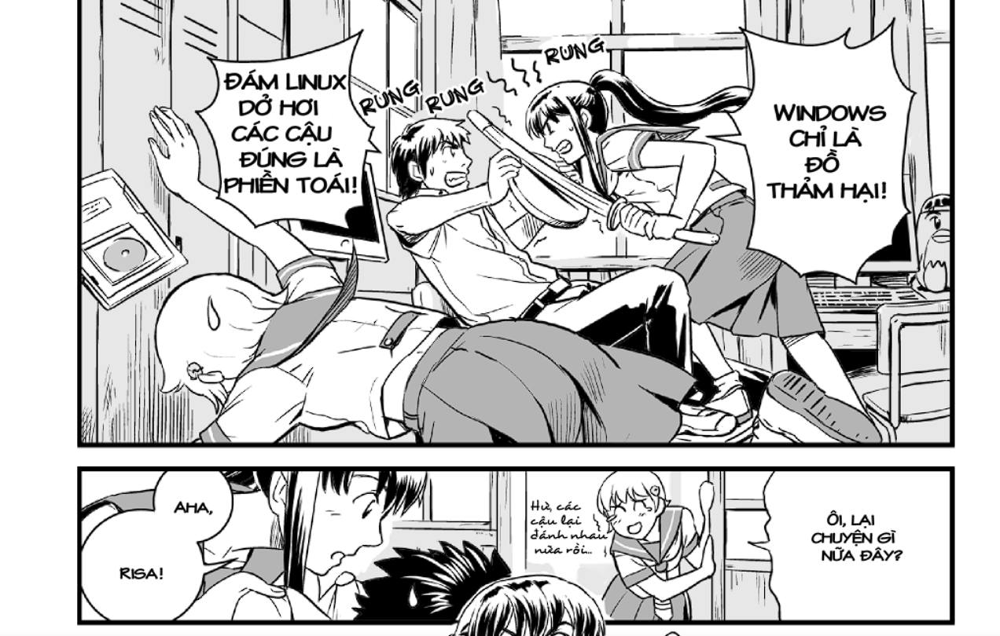

:::tip ❓ Có thể bạn chưa biết
Ý tưởng về Ubunchuu chúng mình xuất phát từ bộ manga cùng tên "Ubunchu!", kể về một câu lạc bộ học Linux ở trường THPT Ichinomiya, chuyện xoay quanh hành trình của cô gái Akane dụ dỗ từng học sinh ở trường hãy xóa Windows, cùng nhau chia sẻ việc học Linux, học CLI, Shell Scripting...
:::

Nung nấu từ ý tưởng này, chúng mình lập ra "Ubunchuu Trường Ú" (thay vì là trường Ichinomiya).

<!-- truncate -->

Tết Âm Lịch 2024 này chúng mình có dự án dịch truyện "Ubunchu!" sát nghĩa từ tiếng Anh (truyện có nhiều thuật ngữ chuyên ngành IT nên những bản Tiếng Việt đã có trên internet hiện đang dịch sai khá nặng), bạn nào có hứng thú thì inbox cho page để apply nhé. (trên mạng đã có người dịch nhưng họ đã drop từ rất lâu, vì vậy chúng mình muốn tiếp tục công trình này).

Cùng đón chờ nhé!