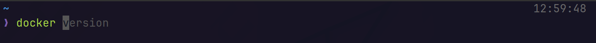
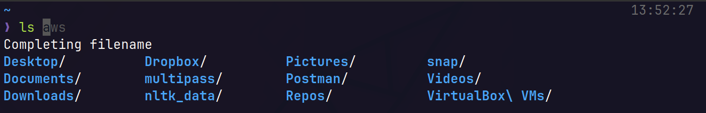
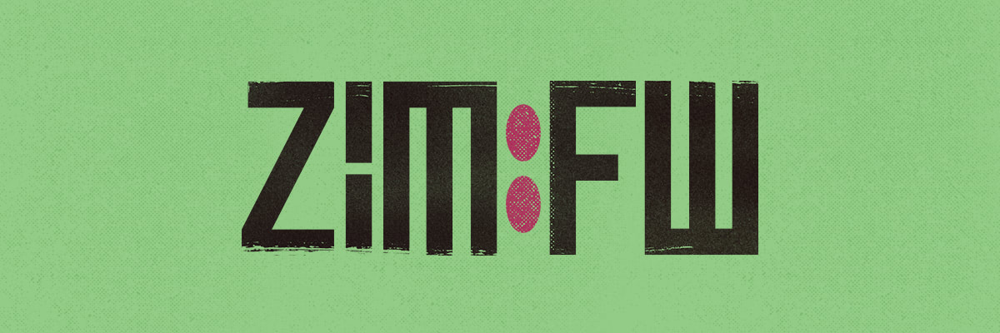

Đối với Ubuntu và đa số các distro của Linux khác, shell (có thể hiểu đơn giản là công cụ giúp ta giao tiếp với Linux bằng câu lệnh - commandline) **mặc định sẽ là Bash Shell** (có người còn hay gọi vui là *"shell đồng tiền"*, vì nó có ký hiệu `$` ở đầu câu lệnh).

Một số cái tên khác bạn có thể bắt gặp:
- Sh (Bourne Shell)
- Fish (Friendly Interactive Shell)
- Ksh (Korn Shell)
- Zsh (Z Shell)

Và tương lai còn có GPT-Shell 🤡.


Tuy nhiên, Bash Shell gặp một số vấn đề về hiệu năng khi ta thực hiện những việc mang tính chất "nặng đô" như: tìm kiếm trong cây thư mục (nhấn `Tab`), tìm lại các lệnh đã sử dụng trong lịch sử (phải thực hiện thao tác`cat ~/.bash_history | grep -i...`), và hơn hết, Bash Shell cực kỳ hạn chế về khả năng custom, như cài theme, plugins, autofill, syntax highlighting...

:::tip
Và **Z Shell** (hay **zsh**) ra đời là để giải quyết những hạn chế của Bash Shell.
:::


Để điểm danh một số ưu điểm của `zsh` mà Ubunchuu chúng mình thấy nổi bật nha:
- **Syntax Highlight**, **Auto Suggestions**: Bộ đôi plugins này chúng mình thấy như là essential khi làm việc trên terminal luôn, kể cả trong công việc hay học tập thường ngày, hai plugins này luôn là "ân nhân cứu cánh" những Ubunchuu-ers giúp hoàn thành câu lệnh, để tiết kiệm thời gian cũng như tránh việc tụi mình tự gõ và gõ nhầm lệnh shell.



:::info
**Syntax highlight chữ đầu** câu lệnh cũng giúp tụi mình nhận biết được module hay package mà chúng mình đang dùng có được install đúng cách hay chưa, hay có lỗi typo gì không. Ví dụ như hình trên, nếu mình nhập sai (`dockker` thay vì `docker` chẳng hạn) thì câu lệnh sẽ không được highlight màu xanh lá như hình. Ví dụ cho việc nhập sai lệnh:
:::


- **Quản lý file và thư mục:** Không phải bàn đến lý do chính khi mọi người chuyển qua dùng `zsh` rồi, đó là tốc độ của `zsh` khi dùng để làm việc với cây thư mục trong Linux, các bạn cứ thử cài xong và nhấn `TAB` là sẽ thấy rõ sự khác biệt.



- **Plugin và theme:** Hỗ trợ plugin và theme cực kỳ đa dạng, và cũng có cộng đồng phát triển `open-source` rất rộng rãi.


- *Nói chung là... nhiều lắm, Tux khuyên các bạn hãy dùng và cảm nhận.* Được rồi, giờ thì đến phần cài đặt thôi!

## Cài đặt và cấu hình ZSH tất tần tật từ A-Z



### Tiến hành cài `zsh` core package
- Quaoo giới thiệu nãy giờ nghe tuyệt vời quá, thế thì phần cài đặt `zsh` đây 🥲

```bash
sudo apt-get update
sudo apt-get install zsh -y
```

- Đổi shell mặc định thành zsh bằng lệnh sau:

```bash
chsh -s $(which zsh)
```

Để hiểu hơn về command trên, `chsh` có nghĩa là `change shell`, còn `which zsh` sẽ lấy ra path dẫn tới nơi đã cài đặt zsh trên máy của bạn.

- Thử xem path đã cài của zsh bằng cách gõ lệnh:

```bash
which zsh
```

Lúc này `chsh` sẽ yêu cầu bạn nhập mật khẩu. Sau đấy, bạn có thể tắt terminal đi bật lại. Nếu không apply, hãy thử logout rồi đăng nhập lại.

- Optional: Shell completion khi dùng với alacritty

:::tip
Nếu bạn đang dùng alacritty, hãy chạy các câu lệnh này để thêm phần auto-completion.
:::

```bash
mkdir -p ${ZDOTDIR:-~}/.zsh_functions
echo 'fpath+=${ZDOTDIR:-~}/.zsh_functions' >> ${ZDOTDIR:-~}/.zshrc
cp extra/completions/_alacritty ${ZDOTDIR:-~}/.zsh_functions/_alacritty
```

### Cấu hình trình quản lý plugins, config của ZSH

Về framework giúp bạn quản lý các thiết lập của zsh, Tux recommend bạn chọn framework **`zimfw`** (là package được cải tiến từ `oh-my-zsh` có hiệu năng tốt và rất nhẹ), sau đó là `oh-my-zsh` với độ ưu tiên thấp hơn (Tux khuyên bạn không nên sử dụng thằng này vì gặp vấn đề về hiệu năng, tuy nhiên đây vẫn là lựa chọn an toàn nếu bạn muốn tìm hiểu về zsh script).

- Nếu cài `zimfw` hãy lướt đến mục **Option 2** để xem chi tiết cách cài đặt và cấu hình. (Highly recommended vì `oh-my-zsh` đã quá cũ rồi)
- Nếu cài `oh-my-zsh` hãy lướt đến mục **Option 1**, là lựa chọn dễ dàng hơn, cũ hơn nhưng khá an toàn và có nhiều nguồn tutorial khác trên mạng hơn.

#### Option 1: `oh-my-zsh` (old method but easy)

- Cài đặt `oh-my-zsh`:

```bash
sudo apt-get install git curl
sh -c "$(curl -fsSL https://raw.githubusercontent.com/robbyrussell/oh-my-zsh/master/tools/install.sh)"
```

- Cài đặt theme `powerlevel10k` vào `oh-my-zsh` (một theme khởi đầu rất tốt), với người mới chúng ta hãy cài theme này là đẹp và tiện dụng nhất cho mọi tác vụ, thậm chí đa số thành viên Ubunchuu vẫn đang dùng theme này:

```bash  
git clone --depth=1 https://github.com/romkatv/powerlevel10k.git ${ZSH_CUSTOM:-$HOME/.oh-my-zsh/custom}/themes/powerlevel10k
```

- Enable `powerlevel10k`:

```bash 
nano ~/.zshrc
```

- Tìm dòng ZSH_THEME có trong ~/.zshrc và sau đó replace như thế này (mặc định ~/.zshrc với `oh-my-zsh` sẽ là theme `robbyrussel`):

```text 
ZSH_THEME="powerlevel10k/powerlevel10k"
```

- Source file `~/.zshrc` hoặc tắt rồi mở lại Terminal:

```bash 
source ~/.zshrc
```

- Đến đây hãy config theo hướng dẫn của Powerlevel10k (lưu ý hãy cài Nerd Font trước khi làm bước này, để cài nerd font, bấm vào [link này](https://github.com/ryanoasis/nerd-fonts))


> Trong trường hợp bạn chưa cài Nerd Font mà đã hiện bảng trên, hãy nhấn `q` để thoát, sau đó cài font vào Alacritty (hoặc Terminal Emulator khác), rồi gõ lệnh sau để mở config của `powerlevel10k`
> ```text
> p10k configure
> ```
> Đây cũng chính là câu lệnh config lại Powerlevel10k nếu bạn muốn config mới.

- Cài đặt plugins thiết yếu cho bằng `oh-my-zsh`:
```bash  
git clone https://github.com/zsh-users/zsh-autosuggestions ${ZSH_CUSTOM:-~/.oh-my-zsh/custom}/plugins/zsh-autosuggestions
git clone https://github.com/zsh-users/zsh-syntax-highlighting.git ${ZSH_CUSTOM:-~/.oh-my-zsh/custom}/plugins/zsh-syntax-highlighting
```

- Cuối cùng là mở lại `~/.zshrc` bằng lệnh `vim ~/.zshrc` là sửa phần plugins như sau (nếu không có các bạn hãy thêm mới vào):

```text 
plugins=(git zsh-autosuggestions zsh-syntax-highlighting)
```

#### Option 2: `zimfw` (Highly recommended)


- Gỡ cài đặt `oh-my-zsh` nếu bạn đã cài sẵn:

```bash
source ~/.oh-my-zsh/tools/uninstall.sh
```

**Khởi động lại terminal, bạn phải đảm bảo zsh của bạn trống trơn, không còn dấu vết của `oh-my-zsh`.**

- Cài đặt zimfw

```bash
curl -fsSL https://raw.githubusercontent.com/zimfw/install/master/install.zsh | zsh
# Hoặc dùng wget
wget -nv -O - https://raw.githubusercontent.com/zimfw/install/master/install.zsh | zsh
```

Kiểm tra zim được cài thành công chưa:

```bash
zimfw
```


- Sau đấy bạn hãy vào file `~/.zshrc` bằng nano/vim/vscode và tìm đến dòng có nội dung này:

```text
# Use modern completion system
autoload -Uz compinit
compinit
```

Comment out 2 dòng này lại như hình bên dưới. Lý do là zimfw sẽ tự động source `comp init` nên không cần phải source từ `zshrc`.


Mặc định Zim đã cài sẵn cho bạn vài plugin như `git`, `zsh-autosuggestions`, `zsh-syntax-highlighting`... Bạn có thể dùng luôn mà không cần config gì thêm.

#### Customize themes

Theme mặc định của Zim là [asciiship](https://github.com/zimfw/asciiship), bạn có thể chọn themes được Zim [build sẵn](https://zimfw.sh/docs/themes/) hoặc theme khác tùy ý.

Ví dụ ở đây Tux sẽ dùng theme `eriner`, vào file `~/.zimrc`, comment dòng `zmodule asciiship` và thêm `zmodule enriner`:

```bash
# ~/.zimrc
# Theme enriner
# zmodule asciiship
zmodule eriner
```

Sau đó chạy lệnh:

```bash
zimfw uninstall && zimfw install
```

Bật lại terminal và enjoy!


**Còn Powerlevel10k thì sao?**

Bạn có thể xóa theme phía trên đi và thêm dòng này vào file `~/.zimrc`:

```
# ~/.zimrc
# ... config modules
zmodule romkatv/powerlevel10k
```

Thực hiện lệnh tương tự. `zimfw install`, khởi động lại terminal rồi `p10k configure`.


### Tham khảo thêm

- Kho plugin đồ sộ của zsh (cài trên `oh-my-zsh` hoặc `zimfw` đều được): https://github.com/unixorn/awesome-zsh-plugins
- Zimfw: https://github.com/zimfw
