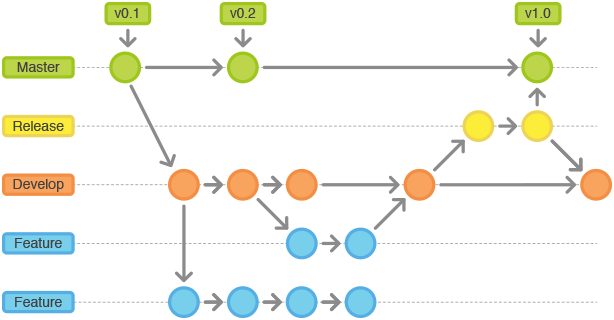

## Git, Github và Những Thao Tác cơ bản

**_"Các bạn có thể thắc mắc: 'Git thì liên quan cái vẹo gì đó đến Linux nhỉ?'"_**

Bố tổ của Linux (Linus Torvald) khi làm việc với source code và quản lý nhóm làm việc với code, đã gặp rất nhiều rắc rối khi xoay xở với các phiên bản của code (khi người này up code lên thì mất code của người kia). Thời điểm đó, người ta thường sử dụng các công cụ như Sourcetree, CVS (Concurrent Versions System), SVN (Subversion), ...

Vì vậy, ngoài việc tạo ra Linux, Linus Torvalds còn phát triển Git để làm việc với source code hiệu quả hơn.


### :memo: Git là gì ?

**Git** là một [**hệ thống quản lý phiên bản phân tán (Distributed Version Control System - DVCS)**](https://en.wikipedia.org/wiki/Distributed_version_control) phổ biến và mạnh mẽ, được phát triển bởi [Linus Torvalds](https://en.wikipedia.org/wiki/Linus_Torvalds) vào năm 2005. Sự ra đời của Git nhằm hỗ trợ việc quản lý mã nguồn, hợp tác làm việc nhóm và theo dõi quá trình thực hiện trong các dự án lớn.

:::tip

Cách đọc: viết sao đọc vậy. g-i-t, không phải "dít" nha 🐧

:::

Với **Git**, mỗi thành viên trong nhóm có thể làm việc độc lập trên các nhánh (**branch**) riêng của mình và sau đó hợp nhất (**merge**) thay đổi vào nhánh chính khi cần thiết. Điều này giúp ngăn chặn xung đột và cho phép cùng một dự án được phát triển song song một cách hiệu quả.

Thông thường ở những phiên bản linux mới nhất, Git đã được cài đặt sẵn cùng với hệ thống. Bạn có thể kiểm tra thông qua câu lệnh sau:

```bash
git --version
```

Câu lệnh sẽ trả về phiên bản Git đã được cài đặt trên hệ thống. Ví dụ:

```console
git version 2.34.1
```

:::info

Nếu Git chưa được cài đặt, hãy sử dụng câu lệnh sau:

```bash
sudo apt-get install git
```

Đối với các distribution khác Debian, bạn có thể truy cập [**Git**](https://git-scm.com/download/linux) và làm theo hướng dẫn.

:::

### Git và Github

**Git** và [**Github**](https://github.com/) là hai khái niệm khác nhau.

> Nghe hơi lạ nhỉ? Hầu hết ai mới tìm hiểu về Git sẽ bị nhẫm lẫn giữa 2 khái niệm này do chúng viết gần giống nhau. Vậy Tux sẽ giúp bạn phân biệt hai khái niệm này nhé.

GitHub là một nền tảng dịch vụ lưu trữ mã nguồn trực tuyến. Nó cung cấp một môi trường để lưu trữ, chia sẻ và làm việc cùng nhau trên các dự án phần mềm sử dụng Git. Khi bạn sử dụng GitHub, thực tế là bạn đang làm việc với Git ở phía bên dưới.


GitHub bao gồm các thành phần và tính năng quan trọng sau:

- **Repositories**: Kho lưu trữ là nơi lưu trữ mã nguồn liên quan đến một dự án cụ thể.
- **Branches**: GitHub cho phép tạo và quản lý các branch làm việc song song trong kho lưu trữ giúp người dùng làm việc độc lập trên các tính năng, sửa lỗi mà không ảnh hưởng đến branch chính.
- **Merge**: GitHub cung cấp các công cụ để hợp nhất các thay đổi từ các branch khác nhau vào branch chính.
- **Issues**: GitHub cho phép người dùng tạo và theo dõi các vấn đề liên quan đến dự án. Issue có thể là báo cáo lỗi, yêu cầu tính năng hoặc nhiệm vụ cần hoàn thành.
- **Pull Requests**: Pull Request (PR) là một tính năng cho phép người dùng đề xuất sự thay đổi từ một branch vào branch khác. Khi một PR được tạo, thành viên khác có thể xem xét, bình luận và đánh giá các thay đổi trước khi merge vào branch chính.

### Git Workflow

**Git Workflow** là một phương pháp sử dụng các nhánh (**branch**) và luồng công việc (**workflow**) cụ thể để quản lý và kiểm soát quá trình phát triển dự án.



Cấu trúc của Git Workflow bao gồm các branch sau đây:

- Branch **master**: là branch chính và ổn định của dự án. Đây là branch đã được kiểm tra và phê duyệt để sẵn sàng phát hành (ready to release).
- Branch **develop**: là nơi các thành viên trong nhóm làm việc và tích hợp các tính năng, sửa lỗi và các thay đổi mới.
- Branch **feature**: là nơi phát triển các tính năng mới. Sau khi tính năng hoàn thành, nó sẽ được merge trở lại vào branch **develop** hoặc **main**.
- Branch **release**: được tạo ra từ branch **develop** khi chuẩn bị cho việc phát hành một phiên bản mới của phần mềm. Trên branch **release**, các hoạt động như kiểm tra lần cuối, chỉnh sửa mã nguồn, tài liệu và chuẩn bị cho việc phát hành được thực hiện. Sau đó, branch **release** sẽ được merge vào cả branch **master** và branch **develop**.
- Branch **hotfix**: được sử dụng để sửa lỗi cấp bách trong phiên bản đã phát hành. Khi phát hiện lỗi trên branch **master**, một branch **hotfix** sẽ được tạo ra từ branch **master**. Sau khi sửa lỗi, branch **hotfix** sẽ được merge vào cả branch **master** và branch **develop**.

### Local Repository và Remote Repository

**Local Repository** (kho lưu trữ cục bộ) là một bản sao của toàn bộ dự án Git được lưu trữ trên máy tính cá nhân của bạn, cho phép bạn làm việc và thực hiện các thay đổi trên dự án mà không cần kết nối mạng hoặc phụ thuộc vào **Remote Repository**.

**Remote Repository** (kho lưu trữ từ xa) là một nơi lưu trữ chính của mã nguồn trong hệ thống Git được đặt trên một máy chủ từ xa hoặc trên một dịch vụ quản lý Git như GitHub, GitLab, hay Bitbucket. Nó được sử dụng để chia sẻ và đồng bộ mã nguồn giữa các thành viên trong nhóm.


Khi bạn **clone** một **Remote Repository**, một bản sao cục bộ của Repository đó được tạo trên máy tính của bạn. Sau khi làm thêm, chỉnh sửa mã nguồn, bạn có thể **push** các thay đổi từ **Local Repository** lên **Remote Repository** để chia sẻ và đồng bộ hóa công việc với các thành viên khác trong nhóm.

### Ba trạng thái (The Three States)


Trong Git, có ba trạng thái chính được gọi là "**The Three States**":

- **Working Directory** (Thư mục làm việc): Đây là trạng thái trong đó bạn đang làm việc trực tiếp trên các tệp tin và thư mục trong dự án của bạn.
- **Staging Area** (Vùng chứa tạm thời): Đây là trạng thái trung gian giữa thư mục làm việc và kho lưu trữ Git. Khi bạn thực hiện lệnh `git add` trên một tệp tin hoặc thư mục, các thay đổi của nó sẽ được thêm vào vùng chứa tạm thời. Các tệp tin trong vùng chứa tạm thời đã được theo dõi bởi Git và sẵn sàng để được commit.
- **Repository** (Kho lưu trữ): Đây là trạng thái cuối cùng của các tệp tin và lịch sử của kho lưu trữ Git. Khi bạn thực hiện lệnh `git commit`, các thay đổi từ **Staging Area** sẽ được lưu trữ vĩnh viễn trong kho lưu trữ. Các commit được lưu trữ trong kho lưu trữ tạo thành lịch sử của dự án và có thể được truy cập, xem lại và quay lại vào bất kỳ thời điểm nào.

### Học Git thông qua sách

Nếu bạn đam mê và có xu hướng lấy kiến thức từ sách, Tux gợi ý cho các bạn cuốn sách [**Pro Git - 2nd Edition (2014)**](https://git-scm.com/book/en/v2) được viết bởi Scott Chacon và Ben Straub, xuất bản bởi Apress. Sách được cập nhật với các chỉnh sửa và bổ sung từ hàng trăm contributors.

> **_'The version found here has been updated with corrections and additions from hundreds of contributors.' - Git Book_**

### Sử dụng Git bằng Commands hay GUI ?

Thao tác với Git không bắt buộc bạn phải sử dụng cụ thể Git Commands hoặc GUI. Hãy thử sử dụng từng cách và xem bạn phù hợp với cách nào nhé.


:::warning note

Trong phạm vi bài viết này, Tux sẽ tập trung sử dụng Git bằng Commands kết hợp với phần mềm [GitKraken](https://www.gitkraken.com/) để trực quan hóa [**Gitflow Workflow**](#Gitflow-Workflow).

:::

## Thao tác cơ bản với Git

Để bắt đầu sử dụng Git, chúng ta cần di chuyển vào trong thư mục dự án.

Chúng ta sẽ bắt đầu một dự án mới có tên là `movie`

```bash
mkdir movie
cd movie/
```

:::warning note

Trong phạm vi bài viết này, Tux chỉ đề cập tới **Local Repository**. Ở các bài viết sau, Tux sẽ đi sâu hơn về **Remote Repository**

:::

### `git init` - Khởi tạo một Git Repository

Để sử dụng Git, chúng ta cần có một dự án mà chúng ta muốn quản lý. Đây có thể là một dự án mới hoặc một dự án hiện có.

Khởi tạo Git bằng dòng lệnh sau:

```bash
git init
```

Lúc này Terminal của bạn sẽ trả về kết quả như sau:

```console
Initialized empty Git repository in ~/book/.git/
```

Chắc hẳn bạn sẽ tò mò liệu Git đã được khởi tạo như thế nào? Khi bạn khởi tạo một kho lưu trữ Git hoặc **clone** một kho lưu trữ hiện có, thư mục `.git` sẽ được tạo ra trong thư mục gốc của dự án.

:::info

### Giới thiệu về thư mục `.git`

Thư mục `.git` chứa thông tin về phiên bản của dự án, đồng thời theo dõi tất cả những thay đổi được thực hiện đối với các tệp trong dự án và ghi lại lịch sử thay đổi đó theo thời gian.

Thư mục `.git` chứa các thành phần sau:

- Thư mục **objects**: Thư mục này chứa các đối tượng Git, bao gồm các phiên bản hoặc trạng thái của tệp trong lịch sử của kho lưu trữ.
- Thư mục **refs**: Thư mục này chứa các tham chiếu (**references**), bao gồm các branch (**branches**), nhãn (**tags**) và các tham chiếu khác.
- Tệp tin **HEAD**: Tệp tin HEAD chứa tham chiếu tới branch hiện tại mà bạn đang làm việc.
- Tệp tin **config**: Tệp tin config chứa cấu hình của kho lưu trữ, bao gồm tên và địa chỉ email của người dùng, cài đặt remote và nhiều thiết lập khác của Git.
- Tệp tin **index**: Tệp tin index (còn được gọi là **Staging area**) lưu trữ thông tin về các tệp và thay đổi đã được thêm vào để sẵn sàng cho **commit**. Khi bạn thực hiện lệnh "**git add**" để đưa các thay đổi vào **Staging area**, thông tin về các tệp tin đó được lưu trữ trong tệp tin index.

Để kiểm tra sự tồn tại của file này, bạn có thể dùng dòng lệnh sau:

```bash
ls -a | grep .git
```

:::

### `git status` - Xem trạng thái của Git Repository

```bash
git status
```

`git status` cung cấp thông tin về trạng thái hiện tại của Git Repository và mã nguồn của nó. Nó hiển thị các thông tin khác nhau về các tệp tin trong **Working Directory**, bao gồm các tệp tin đã được thêm mới, đã bị xóa đi và đã được sửa đổi.

```terminal
On branch master
No commits yet
nothing to commit (create/copy files and use "git add" to track)
```

:::tip

Hãy thường xuyên sử dụng lệnh này để kiểm tra trạng thái, sự thay đổi mã nguồn trong Repository nhé.

:::

### `git add` - Cập nhật thay đổi lên Staging Area.

```bash
git add <file-name> <path/to/directory/>
```

Khi bạn thực hiện lệnh này, Git sẽ hiểu rằng bạn muốn theo dõi và chuẩn bị các thay đổi đó để **commit**.

```bash
# Create a new file
touch header.txt

# Stage change to Staging Area
git add header.txt
```

Cập nhật thay đổi cho nhiều file trong Working Directory lên **Staging Area** cùng lúc:

```bash
git add .
```

### `git commit` - Tạo một commit mới trong kho lưu trữ Git

```bash
git commit -m <commit-text>
```

Khi bạn thực hiện lệnh `git commit`, Git sẽ tạo ra một **commit** mới chứa các thay đổi từ vùng chứa tạm thời và lưu trữ nó trong **Repository**. Một **commit** trong Git đại diện cho một phiên bản của dự án và bao gồm các thay đổi đã được thêm vào **Staging Area**.

Tham số `-m` giúp bạn có thể ghi tóm tắt nội dung thay đổi của các file. Nếu bạn không ghi kèm tham số `-m`, bạn sẽ lạc vào trình soạn thảo văn bản [Vim](https://www.vim.org/) - nơi mà bạn có thể không biết cách thoát ra nếu bị lạc vào.

:::tip

Nội dung của commit thường được viết dưới dạng thì hiện tại đơn (present tense).

Ví dụ: 'make xyzzy do frotz'

:::

```bash
# Commit a change
git commit -m "add header"
```

Điền message trong commit là điều làm Tux đau đầu nhất.


Tuy nhiên nếu bạn không thích thêm tham số `-m` vào câu lệnh `git commit` và không quen sử dụng Vim, Git hỗ trợ các trình soạn thảo văn bản khác tại [**đây**](https://git-scm.com/book/en/v2/Appendix-C%3A-Git-Commands-Setup-and-Config)

:::tip

Ví dụ: Sử dụng **Visual Studio Code** thay thế cho **Vim** để nhập vào nội dung commit:

```bash
git config --global core.editor "code --wait"
```

```console
[master (root-commit) 9aca364] add header
 1 file changed, 0 insertions(+), 0 deletions(-)
 create mode 100644 header.txt
```

:::

Câu hỏi được đặt ra: "**Có cách nào để đi lại nước đi này hay không trong trường hợp sai sót về commit?**". Câu trả lời là có, hãy thêm tham số `--amend` vào câu lệnh.

```bash
# Commit with mistake message
git commit -m <mistake message>

# Add forgotten file
git add <forgotten-file>

# Redo previous commit
git commit --amend <message>
```

Một câu hỏi khác thú vịxuất hiện: **"Nếu như bạn chỉnh sửa file đó, để tạo commit mới thì phải `git add` rồi `git commit`. Có cách nào gộp hai quy trình này không?"**. Câu trả lời là có, chúng ta có thể thêm tham số `-am` biểu thị sự kết hợp của hai quy trình này.

```bash
git commit -am <message>
```

:::warning note

Câu lệnh này không thể thực hiện khi xuất hiện các file **untracked** (file mới được tạo). Khi cho tham số -a thì nó tương đương thực hiện lệnh git add để đưa các file đang được giám sát có sự thay đổi vào staging area rồi tự động commit.

:::

### `git log` - Xem lịch sử commit của Repository

```bash
git log
```

`git log` hiển thị danh sách các commit đã được thực hiện, bao gồm thông tin như ID commit, tác giả, thời gian commit, và nội dung của commit.

> Lưu ý: Để thoát ra, hãy ấn phím `Q` nha.

Để hiển thị một cách ngắn gọn hơn, bạn có thể thêm tham số `--oneline` vào câu lệnh:

```bash
git log --oneline
```

Git sẽ hiển thị danh sách các commit theo thứ tự từ mới nhất đến cũ nhất, mỗi commit chỉ với một dòng thông tin.

```console
9aca364 (HEAD -> master) add header
```

### Ignoring Files

Trong Git, để bỏ qua (**ignore**) các file và thư mục không muốn theo dõi (**track**) và đẩy lên Repository, bạn có thể sử dụng tệp tin `.gitignore`. Điều này là thực sự cần thiết vì không phải file hay thư mục nào bạn cũng đều muốn commit khi có sự thay đổi.

Thông thường, những thứ được thêm vào `.gitignore` bao gồm:

- Secrets, API keys, Credentials, ...
- Operating System files
- Log files
- Dependencies và packages
- ...

Tùy vào mục đích và ngôn ngữ của mã nguồn mà file `.gitignore` có nội dung khác nhau. Bạn có thể tham khảo tại [**đây**](https://www.toptal.com/developers/gitignore/).

Để tạo file `.gitignore` trong dự án:

```bash
touch .gitignore
```

:::info

Ví dụ: Nội dung của `.gitignore` có thể có dạng như sau:

```text
*.log // Bỏ qua tất cả các file có đuôi là .log
folderName/ // Bỏ qua thư mục 'folderName'
file.txt // Bỏ qua file cụ thể 'file.txt'
```

:::

Tux muốn lưu ý rằng hãy ignore đúng file, đúng folder cần thiết nhaaa.


## 📑 Bài tập

1. Tạo một thư mục **`Programming`** và khởi tạo **Git Repo** trong thư mục đó.
2. Tạo một file **`Languages`** và thêm nội dung sau:

```text
C++
Python
Java
```

3. Hãy kiểm tra và phân tích trạng thái của Repo.
4. Hãy tạo một commit cho file mới vừa được tạo. Chắc chắn rằng nội dung commit sẽ là **`create Languages file in project`**
5. Hãy kiểm tra của Repo thêm một lần nữa.
6. Tạo một file mới **`IDEs`** và thêm nội dung sau:

```text
Visual Studio
Visual Studio Code
Sublime Text
```

7. Thêm vào file **`Languages`** nội dung

```text
R
Go
```

8. Hãy kiểm tra và phân tích trạng thái của Repo. Sau đó hãy tạo commit cho **TỪNG** thay đổi với nội dung commit tùy ý.
9. Xóa `Visual Studio` trong file **`IDEs`**. Đồng thời, thêm vào file đó nội dung sau:

```text
Vim
Eclipse
```

10. Hãy tạo commit cho thay đổi mới nhất.
11. Sử dụng lệnh Git để hiển thị danh sách các commit.

## Lời kết

Cảm ơn các bạn đã đọc tới cuối, Tux rất vui và rất mong chờ để được giới thiệu tới các bạn nhiều bài viết hữu ích trong tương lai gần.
