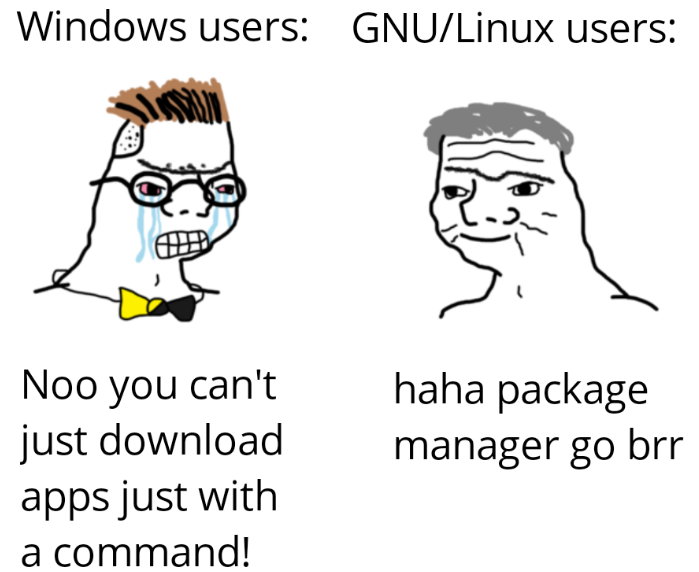

# Day 6 - Package Management

Dùng Linux gần một tuần rồi, các bạn đã thấy câu này quen chưa?

```bash
sudo apt install zsh
```

Đây là cách cài đặt `zsh` (Z-shell) đã đề cập ở các bài trước bằng cách sử dụng package manager APT.

Từ từ đã, package management là gì? Hãy tưởng tượng bạn đang đi siêu thị để mua quà, và nhân viên siêu thị (package manager) giúp bạn tìm quà, rồi gói quà (với giấy gói, hộp giấy, nơ trang trí các kiểu) cho bạn luôn, tất cả trong một 🥸. Thế là, bạn chỉ cần trả tiền (gõ command) và nhận quà về thôi.

## Package manager để làm gì nhỉ

Vậy thì trên Windows, bạn phải lên mạng tìm phần mềm, tải về, rồi cài từng cái một từ dependencies (driver,...) đến cài đặt chính software đó. Còn trên Linux, bạn chỉ cần gõ lệnh thôi, các ứng dụng (và cả dependencies của chúng) sẽ được tải về và cài đặt tự động. Package manager chính là thứ đứng đằng sau sự tự động đó.

Bạn chỉ cần nhớ là mỗi package manager đều giúp bạn làm một việc duy nhất: tải về, cài đặt phần mềm và quản lý phần mềm (cập nhật, gỡ bỏ,...)



> *“Quản lý ứng dụng tinh gọn dành cho người tinh tế!”*

## Các loại package manager trên Linux

### 1. Distribution-Specific Package Managers

Mỗi distro Linux có một package manager khác nhau, ví dụ:

- **APT** cho Ubuntu, Debian.
- **YUM/DNF** cho Fedora, CentOS, RHEL.
- **Pacman** cho Arch Linux.
- **Zypper** cho openSUSE.
- ...

> Các package manager của riêng từng distro như thế này được gọi là **Distribution-Specific Package Managers**.

### 2. Universal Package Managers

Đây là các package manager có thể hoạt động trên nhiều distro khác nhau:

- **Snap** – Phát triển bởi Canonical, có thể chạy trên hầu hết các Linux distro.
- **Flatpak** – Thiết kế để chạy ứng dụng độc lập, sandbox trên Linux.
- **AppImage** – Ứng dụng dạng portable, không cần cài đặt.

> Vì không phụ thuộc vào hệ thống package của từng distro, chúng được gọi là **Universal Package Managers**.

### 3. Low-Level Package Managers

Đây là những công cụ nền tảng, hỗ trợ các package manager cấp cao hơn:

- **dpkg** – Công cụ quản lý gói của Debian (APT sử dụng dpkg).
- **rpm** – Công cụ quản lý gói của Red Hat (YUM/DNF sử dụng rpm).

> Các package manager này hoạt động ở mức thấp hơn, trực tiếp xử lý các tệp `.deb` hoặc `.rpm`.

## Quản lý package trên Ubuntu/Debian với APT

APT được sử dụng trên các hệ điều hành dựa trên Debian như Ubuntu.

### Cập nhật, sửa lỗi, và gỡ phần mềm với APT

> Dùng package manager đúng cách giúp người dùng Linux duy trì hệ thống sạch sẽ, ổn định và luôn cập nhật!

Không chỉ là cài đặt, package manager còn có thể được dùng để:

- **Fix** các package bị lỗi.
- **Update** các package lên phiên bản mới.
- **Gỡ bỏ** phần mềm khỏi máy tính.


### Một số câu lệnh thường dùng với APT

Thật ra thì có khá nhiều câu lệnh để nghịch với apt, các bạn có thể tự khám phá với command `man apt`, nhưng ở đây Tux sẽ hướng dẫn cho các bạn một số syntax quen thuộc thường dùng.

#### 1. Cập nhật danh sách package

```bash
sudo apt update
```

#### 2. Nâng cấp tất cả các package

```bash
sudo apt upgrade -y
```

#### 3. Cài đặt package mới

```bash
sudo apt install <package-name>
```

:::info
Có thể thêm `-y` cuối câu lệnh để skip bước xác nhận Y/n từ package manager, cái này sẽ siêu tiện nếu các bạn đang viết CI hay Dockerfile.
:::

#### 4.Gỡ bỏ package

```bash
sudo apt remove <package-name>
```

Tuy nhiên gỡ cài đặt bằng `remove` vẫn sẽ để lại một số file config, tham khảo cách bên dưới nha.

#### 5. Xóa hoàn toàn package và các file config

```bash
sudo apt purge <package-name>
```

#### 6. Cài đặt từ file .deb

File `.deb` cũng có thể được cài đặt với package manager như `apt` nha, đơn giản chỉ là đặt path (đường dẫn) đến file ở sau `apt install` mà thôi.

```bash 
sudo apt install <absolute-or-relative-path>
```

> Lưu ý rằng, nếu `pwd` (current working dir) của bạn đang cùng một nơi với file `.deb`, hãy thêm `./` ở trước nha, như vậy `apt` sẽ không hiểu nhầm bạn đang cài một package nào dựa trên tên của package đó.

Ví dụ: Cài đặt trình duyệt Google Chrome:

```bash
wget https://dl.google.com/linux/direct/google-chrome-stable_current_amd64.deb

sudo apt install ./google-chrome-stable_current_amd64.deb
```

#### 7. Cài đặt các dependencies bị thiếu

Nếu gặp trường hợp bị thiếu dependencies khi cài package, hãy chạy lệnh sau để `apt` tự fill lại cho bạn:

```bash 
sudo apt install -f
```

### Thêm APT repository mới và cài đặt chúng

APT không chỉ giúp bạn cài đặt package từ kho mặc định mà còn cho phép bạn thêm repository bên ngoài để cài đặt các phần mềm không có sẵn trong hệ thống.

#### 1. Thêm repository mới

Ví dụ, nếu bạn muốn cài đặt một phần mềm từ PPA (Personal Package Archive), bạn có thể thêm nó bằng lệnh:

```bash
sudo add-apt-repository ppa:obsproject/obs-studio
```

Sau đó, cập nhật danh sách package để nhận diện repository mới rồi cài nó thôi:

```bash
sudo apt update
sudo apt install -y obs-studio
```

#### 2. Kiểm tra package từ repository mới

Sau khi thêm repository, bạn có thể tìm kiếm package bằng cách:

```bash
sudo apt search <package-name>
```

Ví dụ:

```bash
sudo apt search obs-studio
```

#### 3. Xóa repository nếu không cần nữa

Nếu bạn muốn xóa repository đã thêm, bạn có thể sử dụng:

```bash
sudo add-apt-repository --remove ppa:obsproject/obs-studio
sudo apt update
```

Hoặc bạn có thể chỉnh sửa trực tiếp file `/etc/apt/sources.list` hoặc xóa file tương ứng trong `/etc/apt/sources.list.d/`.

## Quản lý Package Với dpkg

APT là một package manager built on top của `dpkg`, nhưng nếu bạn có một file `.deb` và muốn cài đặt trực tiếp mà không qua APT, `dpkg` sẽ giúp bạn làm điều đó.

### 1. Cài đặt package từ file .deb

```bash
sudo dpkg -i <package-name>.deb
```

Ví dụ, nếu bạn tải về file cài đặt của Google Chrome:

```bash
sudo dpkg -i google-chrome-stable_current_amd64.deb
```

Nếu gặp lỗi thiếu dependencies, bạn có thể sửa bằng lệnh:

```bash
sudo apt install -f
```

### 2. Kiểm tra package đã cài

```bash
dpkg -l | grep <package-name>
```

### 3. Gỡ cài đặt package

```bash
sudo dpkg -r <package-name>
```

## Quản lý Package Bên Ngoài Với Snap và Flatpak

Không phải app nào cũng có sẵn trong kho của APT, vì thế Snap và Flatpak ra đời để giúp bạn cài đặt dễ dàng hơn, nhưng cũng vì kho ứng dụng của nó build từ community nên không phải app nào cũng là official và hoạt động ổn định.

> Được cái là nó rất đa dạng và vô tư app trên đây luôn

### 1. Cài đặt và sử dụng Snap

Snap được phát triển bởi Canonical và có thể chạy trên nhiều distro Linux.

:::info
Nếu trong máy chưa có snap, thì mình cài snap thôi nghen:

```bash
sudo apt install snapd
```
:::


Cài đặt một package với Snap:

```bash
sudo snap install spotify
```

Gỡ cài đặt:

```bash
sudo snap remove spotify
```

### 2. Cài đặt và sử dụng Flatpak

Flatpak là một hệ thống sandbox cho ứng dụng Linux. Trước tiên, cần cài đặt Flatpak:

```bash
sudo apt install flatpak
```

Thêm repository Flathub (nơi chứa hầu hết package Flatpak):

```bash
flatpak remote-add --if-not-exists flathub https://flathub.org/repo/flathub.flatpakrepo
```

Cài đặt một ứng dụng, ví dụ VLC:

```bash
flatpak install flathub org.videolan.VLC
```

Chạy ứng dụng:

```bash
flatpak run org.videolan.VLC
```

Gỡ cài đặt:

```bash
flatpak uninstall org.videolan.VLC
```

## AppImage - Ứng Dụng Portable Không Cần Cài Đặt

AppImage là định dạng giúp bạn chạy ứng dụng mà không cần cài đặt. Chỉ cần tải về, cấp quyền thực thi cho file và chạy. Thằng này như kiểu mấy app portable 1 file `.exe` của Windows ấy, và `unikey` là một ví dụ điển hình.

> Đến bố tổ của Linux cũng phải dành một lời khen cho AppImage vì tính tiện dụng của nó:


#### 1. Tải AppImage

Ví dụ, tải Balena Etcher:

```bash
wget https://github.com/balena-io/etcher/releases/download/v1.7.9/balenaEtcher-1.7.9-ia32.AppImage
```

#### 2. Cấp quyền thực thi

```bash
chmod +x ./balenaEtcher-1.7.9-ia32.AppImage
```

#### 3. Chạy ứng dụng

```bash
./balenaEtcher-1.7.9-ia32.AppImage
```

Dùng AppImage sẽ rất tiện ở chỗ là không cần cài đặt, không cần phụ thuộc vào dependencies, chỉ cần tải về và chạy! 🚀

> Tham khảo thêm ở đây nhé [appimage.org](https://appimage.org/)