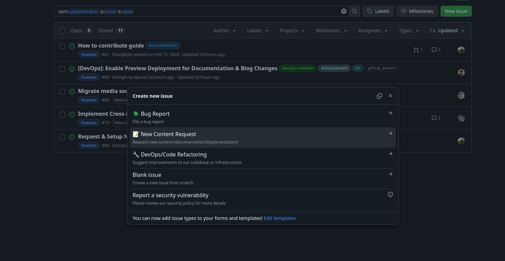
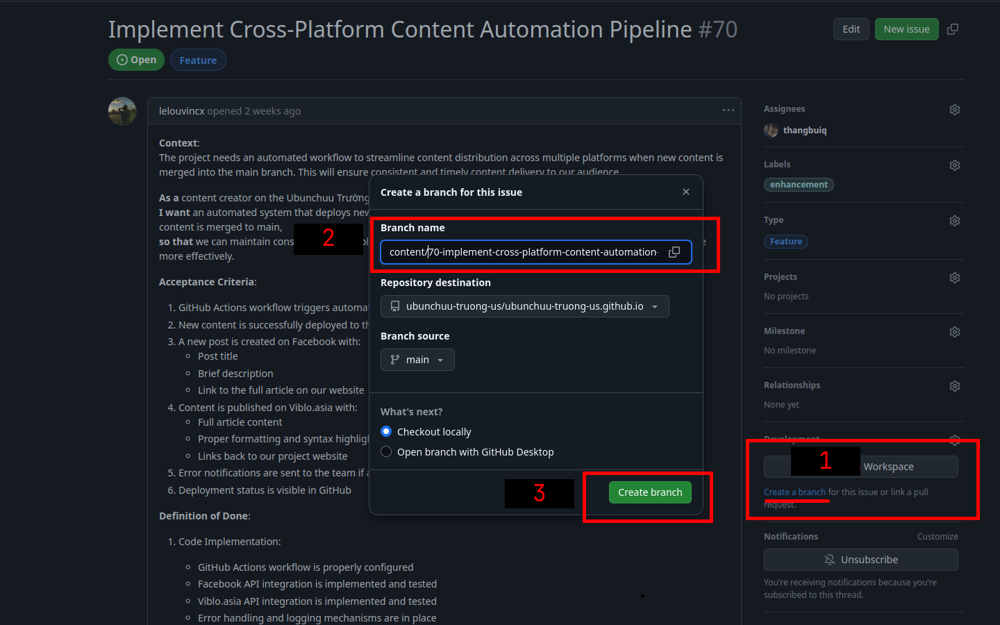
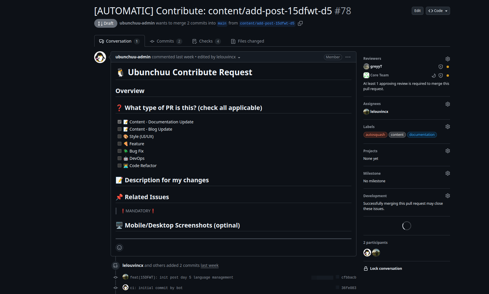
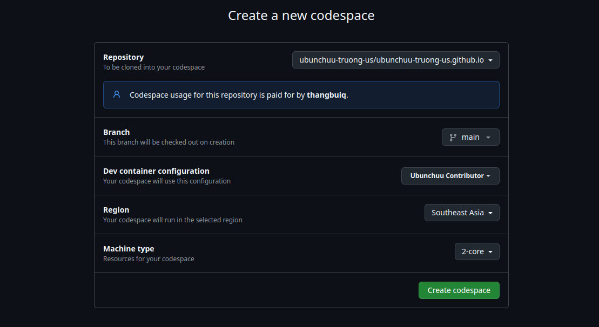
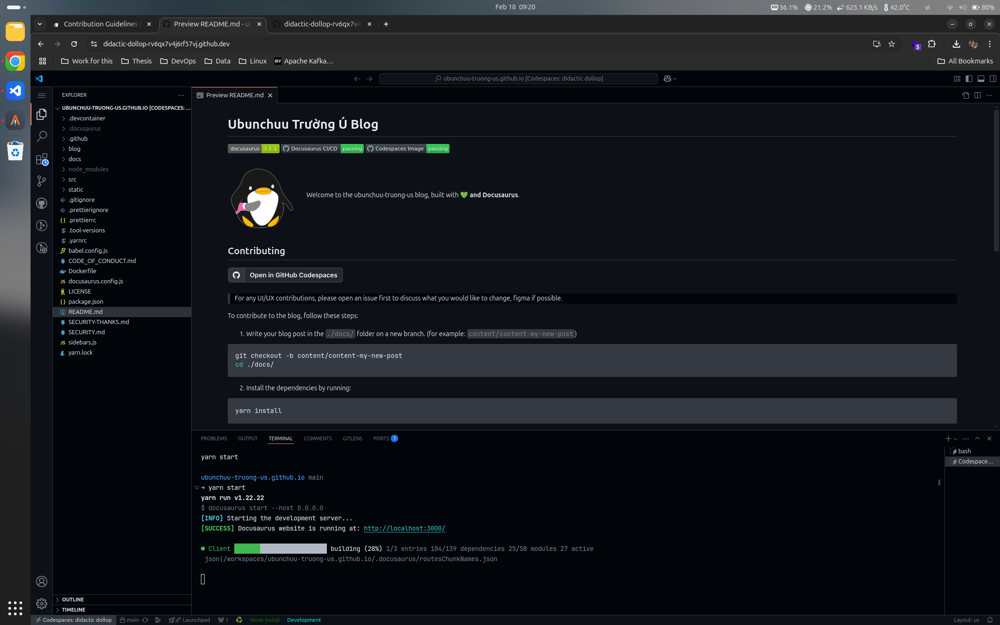

Ubunchuu rất vui khi bạn quyết định đóng góp cho blog của chúng mình. Để đảm bảo mọi người đều thuận tiện và dễ dàng khi đóng góp, chúng mình đã viết ra một số hướng dẫn dưới đây.

## Before You Start

Do đảm bảo mọi thay đổi sẽ được thảo luận và review kỹ lưỡng, chúng mình khuyến khích mọi người tạo một **GitHub Issue** trước khi bắt đầu viết bài. Điều này giúp chúng mình hiểu rõ hơn về nội dung bạn muốn viết và cũng giúp chúng mình xây dựng một cộng đồng đóng góp chặt chẽ hơn.

1. **Bước 1**: Tạo **GitHub Issue** ở repo [ubunchuu-truong-us/ubunchuu-truong-us.github.io](https://github.com/ubunchuu-truong-us/ubunchuu-truong-us.github.io) để thảo luận với chúng mình về những thay đổi bạn muốn thực hiện. Ở đây bạn chọn vào template có tên **New Content Request** nhé.



:::info
Sau khi template được tạo, hãy chờ chúng minh phản hồi và sẽ nhanh mình sẽ tiến hành develop cùng nhau thôi
:::

2. **Bước 2**: Ở Issue đã tạo ở Bước 1, một nhánh/branch mới từ `main` (link với Issue) và đặt tên nhánh theo định dạng `content/<tên-issue-của-bạn>`.

:::tip
Đễ dễ nhất, hãy nhấn **Create a branch** tại *vị trí 1* như hình dưới đây và chỉ cần thêm prefix `content/` vào tên có sẵn.
:::



:::info
Sau khi bạn tạo nhánh mới, một draft pull request sẽ tự động được tạo tự động bởi bot của chúng mình.
:::

Và nó sẽ trông như thế này, lúc này mình cần mọi người Edit lại description của PR cho phù hợp với nội dung bài viết của mình nhé, chỉ cần nhấn vào biểu tượng bút chì như hình dưới đây.



## Cách 1: GitHub Codespaces

Chúng mình đã cung cấp một môi trường Codespaces để bạn có thể dễ dàng đóng góp cho blog của chúng mình. Việc này giúp bạn không cần phải cài đặt môi trường phát triển trên máy tính ở local và cũng sẽ match environment với môi trường CI của chúng mình hơn, đảm bảo tính nhất quán trong việc deployment.

:::info Codespaces là gì vậy ta?
GitHub Codespaces là một môi trường phát triển trên cloud, cho phép bạn viết code, push code, và thậm chí là chạy code mà không cần phải cài đặt bất kỳ thứ gì trên máy tính của bạn. Điều này giúp bạn tiết kiệm thời gian và công sức khi setup môi trường phát triển. [Xem thêm](https://docs.github.com/en/codespaces)

Đối với chúng mình, để dễ hiểu mà nói, GitHub Codespaces chỉ đơn thuần là một cái `VSCode` chạy trên browser thôi. Có sẵn môi trường phát triển, terminal, và mọi thứ bạn cần.
:::

1. **Bước 1**: Tạo GitHub Codespaces để bắt đầu viết bài.

Hãy tạo GitHub Codespaces bằng cách nhấn vào nút "Open in GitHub Codespaces" ở đây:

[](https://codespaces.new/ubunchuu-truong-us/ubunchuu-truong-us.github.io)

:::tip
Hoặc bạn có thể vào [repo của chúng mình](https://github.com/ubunchuu-truong-us/ubunchuu-truong-us.github.io), nhấn vào nút "Code", chọn thẻ "Codespaces" nhé.
:::

Sau đó tại mục **Branch**, chọn branch đã tạo ở phần [Before You Start](#before-you-start) nhé.



> Chỗ này sẽ cần chờ một lúc cho Codespaces được tải xong.

1. **Bước 2**: Bắt đầu viết bài ở GitHub Codespaces thôi nào.



Mặc định Codespaces sẽ mở trình editor kèm với chạy server local và mở trang preview sẵn cho bạn. Nhưng nếu chưa mở, bạn có thể chạy lệnh sau để mở preview nhé:

```bash
yarn start
```

3. **Bước 3**: Khi bạn đã hoàn thành viết bài, hãy commit và push changes của bạn lên repo của chúng mình.

> Pull request sẽ tự động được cập nhật khi bạn push lên nhánh của bạn đã tạo ở bước 2 phần [Before You Start](#before-you-start).

:::important Review và Merge
Khi nào sẵn sàng để review bài viết của bạn, hãy mark **Ready for Review** ở PR của bạn nhé.
:::

## Cách 2: Local Development

Để viết bài ở local, hãy make sure rằng máy tính của mọi người đã cài đặt những dependencies cần thiết như sau:
- `node >= 22`: [Download Node.js](https://nodejs.org/en/download/)
- `yarn >= 1.22`: `sudo npm install -g yarn`
- Issue và branch được tạo như phần [Before You Start](#before-you-start).

1. **Bước 1**: Clone repo của chúng mình về máy tính của bạn.

```bash
git clone git@github.com:ubunchuu-truong-us/ubunchuu-truong-us.github.io.git
```

2. **Bước 2**: Checkout qua nhánh đã tạo ở phần [Before You Start](#before-you-start).

```bash
git checkout content/<tên-bài-viết-của-bạn>
```

3. **Bước 3**: Install dependencies.

```bash
yarn install
```

4. **Bước 4**: Start development server.

```bash
yarn start
```

5. **Bước 5**: Push changes của bạn lên repo của chúng mình nhé, PR sẽ tự động được cập nhật khi bạn push lên nhánh của bạn đã tạo ở bước 2 phần [Before You Start](#before-you-start).

:::important Review và Merge
Khi nào sẵn sàng để review bài viết của bạn, hãy mark **Ready for Review** ở PR của bạn nhé.
:::
