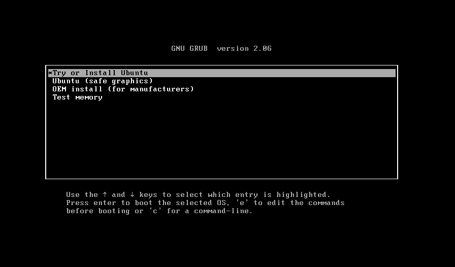
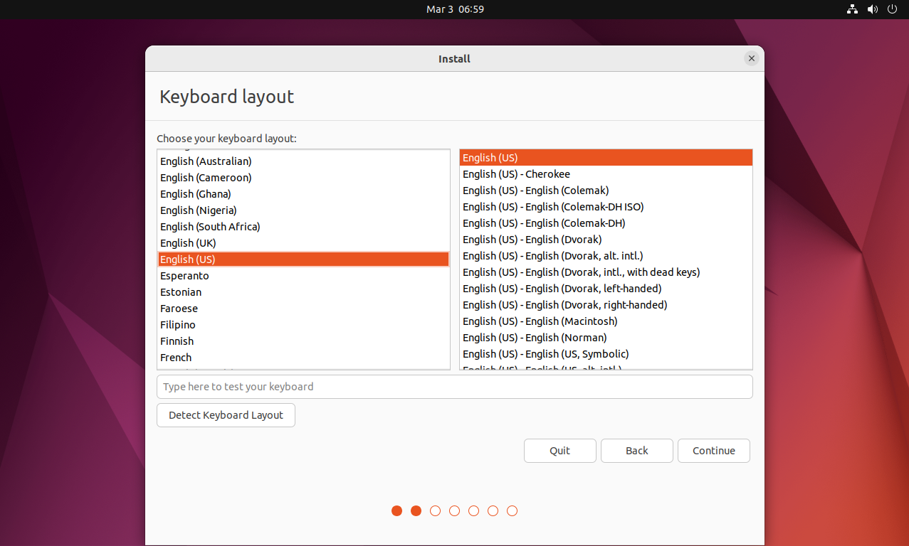
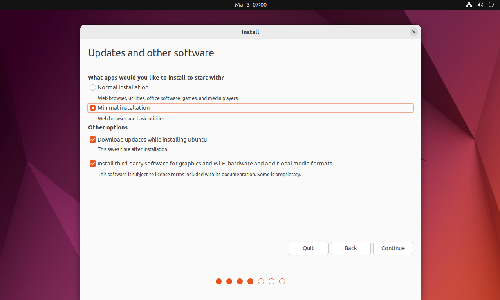
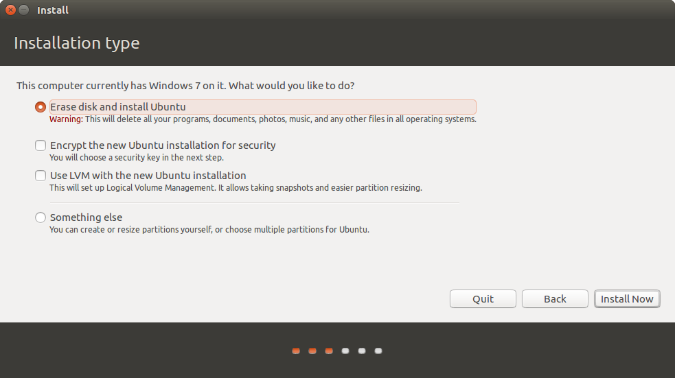

## 1. Giới thiệu về Ubuntu

### Ubuntu hoàn toàn miễn phí và có thể dễ dàng cài đặt trên mọi cấu hình:
Khác với Windows và MacOS, Ubuntu không yêu cầu một khoản phí bất kỳ nào để có thể cài đặt và sử dụng hệ điều hành. 

Việc cài đặt Ubuntu theo tụi mình đánh giá là đơn giản hơn việc cài đặt hệ điều hành Windows khá nhiều. Các bạn chỉ cần có vốn tiếng anh nhất định và sự hiểu biết đơn giản về máy tính.

### Ubuntu đáp ứng nhu cầu về cá nhân hóa:

Ubuntu có tính cá nhân hóa cao hơn khi so sánh với bất kỳ hệ điều hành phổ biến hiện nay (Windows, MacOS). Bạn có thể tùy chỉnh ở nhiều khía cạnh liên quan đến UI để phục vụ cho nhu cầu cá nhân hóa của bản thân.

>Nếu giao diện mặc định của Ubuntu đã quá nhàm chán, Ubunchuu khuyến khích các bạn tìm hiểu về chủ đề này. UI Customization ở Linux thường không quá ảnh hưởng quá nhiều đến hiệu năng của máy (như ngốn RAM, ăn CPU, ..)
>Trong tương lai, Ubunchuu sẽ dành một bài viết riêng về chủ đề này. Tuy nhiên, nếu các bạn muốn tìm hiểu trước, tụi mình sẽ để đường link tham khảo: [LinuxScoop](https://www.youtube.com/@linuxscoop) - một trong những kênh youtube nổi tiếng về Linux UI Customization.

### Một lựa chọn tốt cho việc lập trình: 

Nếu bạn là một dân IT hoặc là một người yêu thích việc gõ code, hoặc cho dù là không đi nữa. Nếu công việc của bạn có liên quan đến việc lập trình, Ubuntu chính là một lựa chọn tốt bởi Ubuntu cung cấp cho bạn một Terminal với sức mạnh "tuyệt đối". Đối với nhiều lập trình viên, việc thao tác với chuột thường khá ít và thao tác dòng lệnh (command line) trên Linux phải gọi là rất "đã" và tốt hơn Windows rất nhiều. Hơn nữa, hầu hết các ngôn ngữ lập trình đều hỗ trợ [CLI (Command Line Interface)](https://www.w3schools.com/whatis/whatis_cli.asp) điều này là cần thiết với các lập trình viên.

### Ubuntu có tính bảo mật cao:

Nghe có vẻ phi lý khi mà Ubuntu là một hệ điều hành miễn phí, mã nguồn mở nhưng lại có tính bảo mật cao? Ubuntu nói riêng và Linux nói chung đều sở hữu quyền "root", điều này cho phép bạn thao tác với hệ thống ở quyền hạn cao nhất (tương đương với Administrator bên Windows). Tuy nhiên, mặc định người dùng hệ thống không được cấp quyền này và nếu có cuộc tấn công nào vào máy tính nhưng lại không có quyền "root" thì cũng phải là 1 điều gì đó quan ngại.

>Nếu Ubuntu chưa phải là sự lựa chọn phù hợp của bạn, hãy tham khảo những Distro khác mà tụi mình đã lên bài ở đây nhé: [Tìm hiểu chung về Linux Distro](/docs/linux-distribution/tim-hieu-chung-ve-linux-distro)

## 2. Các bước chuẩn bị

Ubuntu yêu cầu thiết bị của bạn đáp ứng những yêu cầu sau:
- [x] 2 GHz dual-core processor hoặc hơn.
- [x] Tối thiếu 4 GB RAM (Ubunchu khuyến khích thiết bị của các bạn nên có ít nhất 8 GB RAM để mọi tác vụ của hệ thống trở nên mượt mà).
- [x] Tối thiểu 25 GB dung lượng ổ đĩa.
- [x] Một kết nối Internet xuyên suốt quá trình cài đặt để hệ thống có thể cập nhật và tải những tài nguyên cần thiết.
- [x] USB Boot chứa bộ cài Ubuntu.

### Backup dữ liệu

Việc [Backup](https://en.wikipedia.org/wiki/Backup) tất cả dữ liệu trong máy của bạn trước khi cài đặt Ubuntu là một điều hết sức cần thiết vì trong quá trình cài đặt luôn có xác suất rất nhỏ xảy ra những lỗi liên quan đến hệ điều hành và phần cứng. 

Ubunchuu khuyến khích các bạn nên Backup dữ liệu của mình sang một nơi an toàn như [Google Drive](https://www.google.com/intl/vi_VN/drive/), [OneDrive](https://www.microsoft.com/en-us/microsoft-365/onedrive/online-cloud-storage), [Dropbox](https://www.dropbox.com/), .. để đề phòng trường hợp mất mát dữ liệu khi cài đặt nhé.

### Ghi lại các ứng dụng cần dùng

Trước khi cài đặt Ubuntu, các bạn nên có một cái nhìn tổng quát lại nhu cầu và mục đích của các bạn khi sử dụng Ubuntu. Và hãy đảm bảo rằng nếu các bạn cần làm việc trên một phần mềm nào, phần mềm đó cần có tính tương thích và sẵn sàng để dùng.

### Lưu lại tài khoản, mật khẩu, cài đặt riêng của ứng dụng

Tất nhiên là chúng ta sẽ không muốn mất thời gian để thực hiện công việc "Quên mật khẩu" đâu nhỉ ? Hãy ghi nhớ những tài khoản cần thiết cho ứng dụng bạn làm việc để cho việc cài đặt, trải nghiệm tốt nhất có thể.

### Chuẩn bị USB Boot

Dung lượng của một [Linux Distro](/docs/linux-distribution/tim-hieu-chung-ve-linux-distro) sẽ dao động trong khoảng từ dưới 1 GB cho đến trên 10 GB. Tuy vậy, một distro thông thường với hầu hết các tính năng có sẵn sẽ có dung lượng dao động từ 3 GB đến 5 GB. Ubunchuu khuyến khích các bạn nên chuẩn bị một USB có dung lượng từ 8 GB trở lên để việc tạo USB boot, cài đặt trở nên mượt mà.

1. Các bạn cần tải phần mềm để thực hiện công việc tạo USB boot cho việc cài đặt. Ở đây, Ubunchuu đề xuất phần mềm [Rufus](https://rufus.ie/en/) - một phần mềm dễ sử dụng nhất để tạo USB khởi động trên máy tính và được đánh giá là một trong những công cụ tốt nhất. 

2. Sau khi tải về, các bạn mở file .exe lên. Rufus không yêu cầu quá trình cài đặt nên các bạn chỉ cần tải về và sử dụng luôn.

3. Ở mục đầu tiên (**Device**), các bạn cần chọn USB được dùng trong việc cài đặt. Thông thường, nếu thiết bị của bạn chỉ cắm duy nhất 1 chiếc USB, tên của USB sẽ hiện ra trong ô này.

4. Ở phần **Boot selection**, các bạn ấn vào **"Select"** và tiến hành chọn file ISO Ubuntu đã tải về.

> Tùy thuộc vào phiên bản sẽ có tên khác nhau, của tụi mìn ở đây là "ubuntu-22.04.2-desktop-amd64.iso"

5. Những tùy chọn khác, Ubunchuu khuyến khích các bạn để mặc định. Sau đó, ấn **"Start"**. Một hộp thoại mới hiện lên, các bạn chọn dòng **"Write in ISO Image mode (Recommended)"**.

6. Rufus sẽ hỏi lại về việc xóa hết tất cả dữ liệu trong USB để chuẩn bị cho việc tạo USB boot. Nếu các bạn có dữ liệu gì quan trọng, vui lòng chọn **"Cancel"** và di chuyển những dữ liệu ra ngoài USB. Nếu không, hãy chọn **"OK"**. Các bạn cần đợi một khoảng thời gian ngắn để Rufus thực hiện quá trình của mình.

## 3. Tiến hành cài đặt Ubuntu

Sau khi đã hoàn thành xong việc tạo USB boot chứa bộ cài Ubuntu, Ubunchuu sẽ đưa các bạn đến với những bước cài đặt chính.

1. Khởi động lại thiết bị, cắm USB và tiến hành truy cập vào Menu Boot

> Tùy thuộc vào từng hãng thiết bị mà sẽ có những phím tắt khác nhau để truy cập vào Menu Boot (các phím tắt có thể là F1 -> F12, ESC, DEL, ...). Chi tiết, các bạn truy cập vào link [này](https://www.tomshardware.com/reviews/bios-keys-to-access-your-firmware,5732.html) hoặc thử các phím tắt theo hình bên dưới:

2. Một màn hình đen với các dòng chữ trắng sẽ hiện lên (đối với phiên bản Ubuntu 22.04 LTS trở lên). Các bạn chọn dòng đầu tiên **"Try or Install Ubuntu"**. Lúc này, các bạn cần chờ một khoảng thời gian để bộ cài từ USB được chuẩn bị. 

3. Ubunchuu nhận thấy hầu hết các distro sẽ hỗ trợ tính năng thử nghiệm để mọi người có thể làm quen cũng như khám phá những tính năng của distro đó để đưa ra sự lựa chọn cài đặt hoặc hủy bỏ. Nếu các bạn cảm thấy hài lòng với Ubuntu, hãy chọn **"Install Ubuntu"**.

4. Ubuntu sẽ yêu cầu chọn ngôn ngữ bàn phím, các bạn nên chọn **"English (US)"**. Chọn **"Next"**.

5. Ở bước này, Ubuntu sẽ hỏi rằng bạn muốn cài đặt một phiên bản đầy đủ trình duyệt web, các tiện ích, phần mềm ứng dụng cần thiết (**"Normal installation"**) hay là phiên bản rút gọn với những tiện ích cần thiết (**"Minimal installation"**). Ubunchuu khuyến khích các bạn cài đặt phiên bản đầy đủ (**"Normal installation"**). Ở các lựa chọn sau, các bạn nên tích hết để trong quá trình cài đặt, các bản cập nhật và một số phần mềm bổ sung từ bên thứ 3 sẽ được sẽ được tải xuống. Chọn **"Continue"**.

> Tuy nhiên, các bạn không cần thiết phải chọn hết các tùy chọn để quá trình cài đặt được diễn ra nhanh hơn.

6. Đây là bước quan trọng trong quá trình cài đặt Ubuntu. Chúng ta sẽ có các lựa chọn như sau:

- **Install Ubuntu alongside Windows Boot Manager**: Nếu các bạn muốn cài song song Ubuntu và Windows, đây là lựa chọn phù hợp cho bạn. Ubuntu sẽ tự động nhận diện và cài đặt song song với Windows vào phân vùng trống trên ổ cứng.
- **Erase disk and install Ubuntu**: Toàn bộ ổ cứng sẽ được xóa và quá trình cài mới Ubuntu sẽ diễn ra. Lúc này, Windows sẽ không còn tồn tại nữa.
- **Something else:** Tùy chọn cài đặt một cách thủ công.
> Ubunchu cần các bạn chọn vào mục **"Erase disk and install Ubuntu"**. Chọn **"Install now"**. Hoặc nếu các bạn cần tùy chọn nâng cao cho các phân vùng của Ubuntu, xin hãy chọn **"Something else"** và xem qua bước 7.

7. (Optional - chỉ dành cho những bạn chọn **"Something else"**)

> Xin mời skip bước này và xem đến bước 8 nếu bạn không muốn chia phân vùng tùy thích theo yêu cầu.

Các bạn xem qua hưỡng dẫn chi tiết chia các phân vùng con cho riêng Ubuntu ở bước 7 - phần 4 của bài viết sau: [Bước 7 - Phần 4 của Post: Cài đặt Ubuntu Dual-boot](/docs/installation-guide/dual-boot)

8. Thiết lập vị trí và múi giờ ở nơi chúng ta đang sinh sống. Chọn **"Continue"**.

9. Ubuntu yêu cầu bạn nhập các thông tin cần thiết. Hãy luôn nhớ **password** vì điều này là cần thiết trong quá trình sử dụng. 

> Nếu cần thiết, hãy take-note password mà bạn vừa tạo đi.

> Các bạn có thể chọn **"Log in automatically"** việc nhập password là quá phiền phức mỗi khi khởi động máy, hoặc chọn **"Require my password to log in"** để tăng tính bảo mật cho thiết bị. Chọn **"Continue"**.

10. Quá trình cài đặt sẽ được thực hiện. Thiết bị của bạn sẽ khởi động lại một vài lần, chính vì thế hãy chờ đợi cho đến khi mọi thứ hoàn thành xong.

> Cuối cùng, sau khi quá trình cài đặt đã hoàn tất, hãy khởi động lại máy tính, sau đó rút USB boot ra và nhấn Enter khi nhìn thấy tùy chọn **"Please remove the installation medium then press enter".**

## :100: Lời kết

Hãy trải nghiệm và tận hưởng những tính năng độc đáo của Ubuntu các bạn nhé :heart: