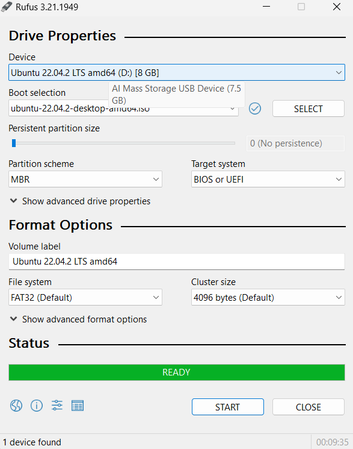
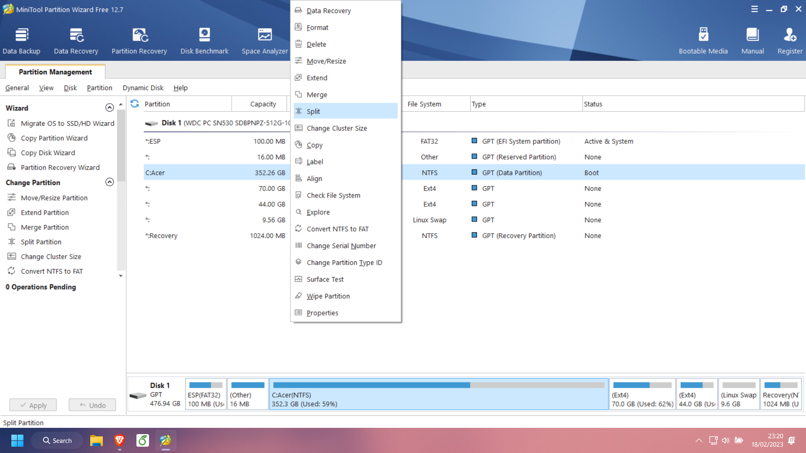

## 1. Giới thiệu về Ubuntu

### Ubuntu hoàn toàn miễn phí và có thể dễ dàng cài đặt trên mọi cấu hình:
Khác với Windows và MacOS, Ubuntu không yêu cầu một khoản phí bất kỳ nào để có thể cài đặt và sử dụng hệ điều hành. 

Việc cài đặt Ubuntu theo tụi mình đánh giá là đơn giản hơn việc cài đặt hệ điều hành Windows khá nhiều. Các bạn chỉ cần có vốn tiếng anh nhất định và sự hiểu biết đơn giản về máy tính.

### Ubuntu đáp ứng nhu cầu về cá nhân hóa:

Ubuntu có tính cá nhân hóa cao hơn khi so sánh với bất kỳ hệ điều hành phổ biến hiện nay (Windows, MacOS). Bạn có thể tùy chỉnh ở nhiều khía cạnh liên quan đến UI để phục vụ cho nhu cầu cá nhân hóa của bản thân.

:::info
Nếu giao diện mặc định của Ubuntu đã quá nhàm chán, Ubunchuu khuyến khích các bạn tìm hiểu về chủ đề này. UI Customization ở Linux thường không quá ảnh hưởng quá nhiều đến hiệu năng của máy (như ngốn RAM, ăn CPU, ..)
:::

:::tip
Trong tương lai, Ubunchuu sẽ dành một bài viết riêng về chủ đề này. Tuy nhiên, nếu các bạn muốn tìm hiểu trước, tụi mình sẽ để đường link tham khảo: [LinuxScoop](https://www.youtube.com/@linuxscoop) - một trong những kênh youtube nổi tiếng về Linux UI Customization.
:::

### Một lựa chọn tốt cho việc lập trình: 

Nếu bạn là một dân IT hoặc là một người yêu thích việc gõ code, hoặc cho dù là không đi nữa. Nếu công việc của bạn có liên quan đến việc lập trình, Ubuntu chính là một lựa chọn tốt bởi Ubuntu cung cấp cho bạn một Terminal với sức mạnh "tuyệt đối". Đối với nhiều lập trình viên, việc thao tác với chuột thường khá ít và thao tác dòng lệnh (command line) trên Linux phải gọi là rất "đã" và tốt hơn Windows rất nhiều. Hơn nữa, hầu hết các ngôn ngữ lập trình đều hỗ trợ [CLI (Command Line Interface)](https://www.w3schools.com/whatis/whatis_cli.asp) điều này là cần thiết với các lập trình viên.

### Ubuntu có tính bảo mật cao:

Nghe có vẻ phi lý khi mà Ubuntu là một hệ điều hành miễn phí, mã nguồn mở nhưng lại có tính bảo mật cao? Ubuntu nói riêng và Linux nói chung đều sở hữu quyền "root", điều này cho phép bạn thao tác với hệ thống ở quyền hạn cao nhất (tương đương với Administrator bên Windows). Tuy nhiên, mặc định người dùng hệ thống không được cấp quyền này và nếu có cuộc tấn công nào vào máy tính nhưng lại không có quyền "root" thì cũng phải là 1 điều gì đó quan ngại.

:::tip
Nếu Ubuntu chưa phải là sự lựa chọn phù hợp của bạn, hãy tham khảo những Distro khác mà tụi mình đã lên bài ở đây nhé: [Tìm hiểu chung về Linux Distro](/docs/linux-distribution/tim-hieu-chung-ve-linux-distro)
:::

## 2. Các bước chuẩn bị

Ubuntu yêu cầu thiết bị của bạn đáp ứng những yêu cầu sau:
- [x] 2 GHz dual-core processor hoặc hơn.
- [x] Tối thiếu 4 GB RAM (Ubunchu khuyến khích thiết bị của các bạn nên có ít nhất 8 GB RAM để mọi tác vụ của hệ thống trở nên mượt mà).
- [x] Tối thiểu 25 GB dung lượng ổ đĩa.
- [x] Một kết nối Internet xuyên suốt quá trình cài đặt để hệ thống có thể cập nhật và tải những tài nguyên cần thiết.
- [x] USB Boot chứa bộ cài Ubuntu.

### Backup dữ liệu

Việc [Backup](https://en.wikipedia.org/wiki/Backup) tất cả dữ liệu trong máy của bạn trước khi cài đặt Ubuntu là một điều hết sức cần thiết vì trong quá trình cài đặt luôn có xác suất rất nhỏ xảy ra những lỗi liên quan đến hệ điều hành và phần cứng. 

Ubunchuu khuyến khích các bạn nên Backup dữ liệu của mình sang một nơi an toàn như [Google Drive](https://www.google.com/intl/vi_VN/drive/), [OneDrive](https://www.microsoft.com/en-us/microsoft-365/onedrive/online-cloud-storage), [Dropbox](https://www.dropbox.com/), .. để đề phòng trường hợp mất mát dữ liệu khi cài đặt nhé.

### Ghi lại các ứng dụng cần dùng

Trước khi cài đặt Ubuntu, các bạn nên có một cái nhìn tổng quát lại nhu cầu và mục đích của các bạn khi sử dụng Ubuntu. Và hãy đảm bảo rằng nếu các bạn cần làm việc trên một phần mềm nào, phần mềm đó cần có tính tương thích và sẵn sàng để dùng.

### Lưu lại tài khoản, mật khẩu, cài đặt riêng của ứng dụng

Tất nhiên là chúng ta sẽ không muốn mất thời gian để thực hiện công việc "Quên mật khẩu" đâu nhỉ ? Hãy ghi nhớ những tài khoản cần thiết cho ứng dụng bạn làm việc để cho việc cài đặt, trải nghiệm tốt nhất có thể.

### Chuẩn bị USB Boot

Dung lượng của một Linux Distro sẽ dao động trong khoảng từ dưới 1 GB cho đến trên 10 GB. Tuy vậy, một distro thông thường với hầu hết các tính năng có sẵn sẽ có dung lượng dao động từ 3 GB đến 5 GB. Ubunchuu khuyến khích các bạn nên chuẩn bị một USB có dung lượng từ 8 GB trở lên để việc tạo USB boot, cài đặt trở nên mượt mà.

1. Các bạn cần tải phần mềm để thực hiện công việc tạo USB boot cho việc cài đặt. Ở đây, Ubunchuu đề xuất phần mềm [Rufus](https://rufus.ie/en/) - một phần mềm dễ sử dụng nhất để tạo USB khởi động trên máy tính và được đánh giá là một trong những công cụ tốt nhất. 

2. Sau khi tải về, các bạn mở file .exe lên. Rufus không yêu cầu quá trình cài đặt nên các bạn chỉ cần tải về và sử dụng luôn.

3. Ở mục đầu tiên (**Device**), các bạn cần chọn USB được dùng trong việc cài đặt. Thông thường, nếu thiết bị của bạn chỉ cắm duy nhất 1 chiếc USB, tên của USB sẽ hiện ra trong ô này.

4. Ở phần **Boot selection**, các bạn ấn vào **"Select"** và tiến hành chọn file ISO Ubuntu đã tải về.

:::info
Tùy thuộc vào phiên bản sẽ có tên khác nhau, của tụi mìn ở đây là "ubuntu-22.04.2-desktop-amd64.iso"
:::

5. Những tùy chọn khác, Ubunchuu khuyến khích các bạn để mặc định. Sau đó, ấn **"Start"**. Một hộp thoại mới hiện lên, các bạn chọn dòng **"Write in ISO Image mode (Recommended)"**.

6. Rufus sẽ hỏi lại về việc xóa hết tất cả dữ liệu trong USB để chuẩn bị cho việc tạo USB boot. Nếu các bạn có dữ liệu gì quan trọng, vui lòng chọn **"Cancel"** và di chuyển những dữ liệu ra ngoài USB. Nếu không, hãy chọn **"OK"**. Các bạn cần đợi một khoảng thời gian ngắn để Rufus thực hiện quá trình của mình.

## 3. Chia phân vùng trên Windows để cài đặt Ubuntu

:::warning note
Nếu máy tính bạn đủ khả năng để phân vùng (cho phép khả năng partition tối đa) thì trước hết ta hãy sử dụng công cụ có sẵn trong máy tính là [Disk Management](https://learn.microsoft.com/en-us/windows-server/storage/disk-management/overview-of-disk-management) để đạt hiệu quả và độ an toàn nhé.
:::

### 3.1. Kiểm tra dung lượng máy tính và nhu cầu của mình

Với người mới bắt đầu hoặc muốn trải nghiệm Ubuntu song song với hệ điều hành Windows, Ubunchuu khuyến khích các bạn nên chia phân vùng tầm 60 đến 100GB cho Ubuntu và thực hiện [Dual-boot](https://en.wikipedia.org/wiki/Multi-booting). Điều này giúp cho Ubuntu có đủ dung lượng hệ thống để thực hiện các tác vụ, giúp các bạn có thể sử dụng Ubuntu một cách thoải mái nhất.

Tuy nhiên nếu bạn chỉ muốn cài đặt để trải nghiệm và không thường xuyên sử dụng trong tương lai, các bạn có thể để tầm 25 GB dung lượng trống như Ubunchu đã đề cập ở phần **chuẩn bị** ở trên. 

### 3.2. Tiến hành chia phân vùng trên máy tính (partition)

Ubunchuu sẽ đưa ra hai cách trong việc chia phân vùng trên máy tính. Cách thứ nhất, Ubunchuu sẽ hướng dẫn các bạn sử dụng công cụ có sẵn trên Windows là [Disk Management](https://learn.microsoft.com/en-us/windows-server/storage/disk-management/overview-of-disk-management). Cách thứ hai, Ubunchuu sẽ nhờ sự trợ giúp của phần mềm [MiniTool Partition Wizard](https://www.partitionwizard.com/download.html) - một trong nhưng phần mềm miễn phí tốt nhất trong việc hỗ trợ phân vùng ổ đĩa. 

#### Cách 1: Phân vùng ổ đĩa với Disk Management

- Nhấn tổ hợp phím Windows + X và chọn Disk Management để mở cửa sổ Disk Management (hoặc chuột phải vào This PC trong File Explorer và chọn Disk Management).

Giao diện của Disk Management hiện ra với trung tâm chính giữa là danh sách các phân vùng ổ đĩa có sẵn trong máy. Tùy vào từng thiết bị mà danh sách các phân vùng.

- Các bạn cần xác định ổ đĩa cần phân vùng. Ở đây, tụi mình sẽ chọn ổ đĩa C với dung lượng 352.26 GB để phân vùng ra một phân vùng mới dung để cài đặt. Chuột phải vào ổ đĩa cần chia nhỏ ra và chọn **Shrink Volume**. Sau đó, máy tính của bạn cần một khoảng thời gian nhỏ để tính toán khả năng chia phân vùng.

:::info
Một số máy tính sẽ ngăn cản bãn truy cập vào chức năng này vì một số lý do hệ thống (chi tiết vui lòng truy cập: [How to Fix Can't Shrink Volume in Windows 11/10/8/7](https://www.easeus.com/partition-manager-software/windows-cant-shrink-volume-partition.html). Lúc này, Ubunchuu cần bạn di chuyển đến cách thứ 2 **Phân vùng ổ đĩa với MiniTool Partition Wizard**
:::

- Nhập dung lượng bạn dành cho hệ điều hành Ubuntu vào ô **"Enter the amount of space to shrink in MB"**. Ví dụ nếu bạn muốn dành 50GB cho Ubuntu thì sẽ để là 50 x 1024 = 51200MB

:::warning note
Hãy chọn dung lượng phù hợp cho Ubuntu nhé, đừng chia phân vùng quá lớn (nếu không cần thiết) hoặc quá nhỏ và trên hết là phải nằm trong khả năng cho phép của ổ đĩa.
:::

- Nhấn Shrink và khởi động lại máy tính để PC của bạn hoàn tất tiến trình phân vùng nhé.

Tuy nhiên, nếu trong trường hợp máy tính của các bạn không đủ khả năng cho phép phân vùng nhiều (Dung lượng vượt quá mức dung lượng cho phép chia nhỏ vì bị giới hạn bởi vùng sao lưu an toàn - Recovery Parition) thì sẽ hiện như hình sau: (Total Size sau khi phân vùng sẽ là 0MB)

Lúc này, các bạn nên sử dụng các phần mềm rời bên thứ 3 để thực hiện công việc phân vùng. Ubunchuu sẽ hướng dẫn các bạn chia phân vùng bằng một công cụ mã nguồn mở có độ tin cậy cao và bảo mật nhất, đó chính là **MiniTool Partition Wizard**.

- Nếu các bạn đã thành công ở **bước 4** (nếu không, Ubunchuu sẽ cần bạn qua cách làm khác là: **Phân vùng ổ đĩa với MiniTool Partition Wizard**), một phân vùng trống sẽ hiện ra trong danh sách các phân vùng. Lúc này, các bạn ấn chuột phải vào phân vùng mới đó, chọn **"New Simple Volume"** và thực hiện điền các bước sau:

:::tip
- Các bạn chọn **"Next"** ở cửa sổ đầu tiên.
- Chọn dung lượng cần để tạo phân vùng mới. Ở bước này các bạn chỉ cần ấn **"Next"** mà không cần chỉnh sửa gì hết.
- Chọn ký tự cho phân vùng mới. Chọn **"Next"**.
- Ở bước này, hệ thống sẽ hỏi bạn có muốn format cho phân vùng mới này không ? Ubunchuu cần bạn chọn vào lựa chọn **"Format this volume with the following settings"**. Lưu ý, hãy nhớ chọn **FAT32** ở phần **"File system"**.
Chọn **"Next"** và **"Finish"** để tiến hành phân vùng ổ cứng
:::

:::warning note
Một số máy sẽ không có tùy chọn FAT32 ở phần "File system", lúc này hãy chuyển sang phần **Phân vùng ổ đĩa với MiniTool Partition Wizard**.
:::

#### Cách 2: Phân vùng ổ đĩa với MiniTool Partition Wizard.

:::info note
- Phần này dành cho những bạn không biết setup, những bạn biết rồi có thể bỏ qua:

    Truy cập trang web chính chủ của [MiniTool Partition Wizard](https://www.partitionwizard.com/download.html) và tiến hành tải xuống phiên bản miễn phí (Free Edition) của phần mềm về, sau đó tiến hành setup đơn giản.

    Nhấn vào nút **Local Download**, file cài đặt sẽ được tải về máy, mở file này lên bằng cách nhấn đúp chuột:

    
:::

- Chọn ngôn ngữ là **English** và nhấn **"OK"** ở cửa sổ hiện lên đầu tiên. Sau đó chọn **"Continue installing free edition"** và nhấn Next. (vì bản free đã thực hiện tốt chức năng phân vùng rồi)

- Bỏ chọn công cụ ShadowMaker vì ở MiniTool Partition Wizard chúng ta đã có chức năng Backup dữ liệu rồi.

- Chọn đường dẫn cần cài đặt phần mềm và nhấn **"Next"**.

- Nhấn **"Finish"** để kết thúc cài đặt.

- Mở **MiniTool Parition Wizard** lên, giao diện của phần mềm khá tương đồng với công cụ Disk Management của hệ thống. Nhấn chuột phải vào ổ đĩa cần chia nhỏ phân vùng và nhấn vào tùy chọn **Split**.

- Nhập dung lượng bạn dành cho Ubuntu vào phần **"New Partition Size"** hoặc kéo phần Slide bên trên cho vừa với dung lượng bạn cần (Tụi mình sẽ phân vùng cho Ubuntu với dung lượng vào khoảng 50GB), sau đó nhấn **"OK"**.

- Lúc này, các bạn sẽ thấy một phân vùng trống (Unallocated) có dung lượng 50 GB (Tùy vào dung lượng phân chia của các bạn). Ấn chuột phải vào phân vùng trống này, chọn **"Create"**. Một hộp thoại sẽ hiện lên, các bạn lần lượt nhập các thông tin sau:

:::info
- Partition Label: Tên của phân vùng.
- File System: FAT32 (Điều này là cần thiết để bộ cài Ubuntu nhận diện được phân vùng để cài đặt).
- Drive Letter: Kí tự của phân vùng (Có thể để mặc định theo phần mềm).
- Kiểm tra lại dung lượng một lần cuối trong phần "Size and Location".
:::

Nhấn **"Ok"**

- Nhấn **"Apply"** ở bên trái dưới cùng của ứng dụng để tiến hành công việc phân vùng ổ cứng. Sau đó, các bạn hãy khởi động lại máy tính, đợi boot tầm 5-10p để máy tính tiến hành phân vùng nhé.

Sau khi khởi động lại máy tính, khi vào Disk Management kiểm tra lại bạn sẽ thấy có một phân vùng mới với dung lượng bằng chính dung lượng mà bạn đã chia nhỏ (như mình thì là 50GB).

## 4. Tiến hành cài đặt Ubuntu

Sau khi đã hoàn thành xong việc tạo USB boot chứa bộ cài Ubuntu, Ubunchuu sẽ đưa các bạn đến với những bước cài đặt chính.

1. Khởi động lại thiết bị, cắm USB và tiến hành truy cập vào Menu Boot

:::tip
Tùy thuộc vào từng hãng thiết bị mà sẽ có những phím tắt khác nhau để truy cập vào Menu Boot (các phím tắt có thể là F1 -> F12, ESC, DEL, ...). Chi tiết, các bạn truy cập vào link [này](https://www.tomshardware.com/reviews/bios-keys-to-access-your-firmware,5732.html) hoặc thử các phím tắt theo hình bên dưới:
:::

2. Một màn hình đen với các dòng chữ trắng sẽ hiện lên (đối với phiên bản Ubuntu 22.04 LTS trở lên). Các bạn chọn dòng đầu tiên **"Try or Install Ubuntu"**. Lúc này, các bạn cần chờ một khoảng thời gian để bộ cài từ USB được chuẩn bị. 

3. Ubunchuu nhận thấy hầu hết các distro sẽ hỗ trợ tính năng thử nghiệm để mọi người có thể làm quen cũng như khám phá những tính năng của distro đó để đưa ra sự lựa chọn cài đặt hoặc hủy bỏ. Nếu các bạn cảm thấy hài lòng với Ubuntu, hãy chọn **"Install Ubuntu"**.

4. Ubuntu sẽ yêu cầu chọn ngôn ngữ bàn phím, các bạn nên chọn **"English (US)"**. Chọn **"Next"**.

5. Ở bước này, Ubuntu sẽ hỏi rằng bạn muốn cài đặt một phiên bản đầy đủ trình duyệt web, các tiện ích, phần mềm ứng dụng cần thiết (**"Normal installation"**) hay là phiên bản rút gọn với những tiện ích cần thiết (**"Minimal installation"**). Ubunchuu khuyến khích các bạn cài đặt phiên bản đầy đủ (**"Normal installation"**). Ở các lựa chọn sau, các bạn nên tích hết để trong quá trình cài đặt, các bản cập nhật và một số phần mềm bổ sung từ bên thứ 3 sẽ được sẽ được tải xuống. Chọn **"Continue"**.

:::tip
Tuy nhiên, các bạn không cần thiết phải chọn hết các tùy chọn để quá trình cài đặt được diễn ra nhanh hơn.
:::

6. Đây là bước quan trọng trong quá trình cài đặt Ubuntu. Chúng ta sẽ có các lựa chọn như sau:

- **Install Ubuntu alongside Windows Boot Manager**: Nếu các bạn muốn cài song song Ubuntu và Windows, đây là lựa chọn phù hợp cho bạn. Ubuntu sẽ tự động nhận diện và cài đặt song song với Windows vào phân vùng trống trên ổ cứng.
:::warning not recommended
Ubunchuu khuyên bạn sử dụng cài đặt **Something else** để tự tùy biến theo nhu cầu của bạn với các phân vùng mà bạn cần sử dụng.
:::
- **Erase disk and install Ubuntu**: Toàn bộ ổ cứng sẽ được xóa và quá trình cài mới Ubuntu sẽ diễn ra. Lúc này, Windows sẽ không còn tồn tại nữa.
:::warning note
Các bạn nên cẩn thận khi chọn tùy chọn này.
:::
- **Something else:** Tùy chọn cài đặt một cách thủ công.
Ở đây, vì đã phân chia phân vùng cho Ubuntu ở mục **Chia phân vùng trên Windows để cài đặt Ubuntu**, Ubunchu cần các bạn chọn vào mục **"Something else"**. Chọn **"Continue"**.

7. Danh sách các phân vùng có sẵn trong máy sẽ được liệt kê trong cửa số mới xuất hiện. Các bạn cần tìm đúng phân vùng đã chia ở **Chia phân vùng trên Windows để cài đặt Ubuntu**.

:::warning note
Các phân vùng sẽ khá khó để nhận diện vì tên của chúng lúc này được đặt theo cấu trúc của Linux. Cách dễ dàng nhất để nhận diện phân vùng cần tìm là dựa vào dung lượng chúng ta đã chia cho nó. 
:::

- Đầu tiên, ta cần nhấn đúp chuột vào **"free space"** (tức là phần phân vùng mà bạn đã chia ở **Chia phân vùng trên Windows để cài đặt Ubuntu**) và lần lượt tạo các phân vùng cho máy tính của bạn:

- Tiếp theo chúng mình sẽ phải tạo phân vùng EFI (EFI System Partition) để máy boot vào, phân vùng này chúng ta nên để khoảng 500MB, hoặc nếu bạn thích dư dả tránh trường hợp boot không lên hay crash thì ta cũng có thể để 1000MB. Chọn loại phân vùng **"Use as: EFI System Partition"**: 

- Chọn phần **"free space"** còn lại và thực hiện các thao tác tương tự để tạo lần lượt các phân vùng sau:
  - /efi: 500MB-1GB (đã tạo bên trên)
  - /swap: 2GB (Chọn Use as: **"swap"**, Mount point: *không có*)
  - / (root): phần còn lại (Chọn Use as: **"ext4"**, Mount point: **"/"**)

:::tip
- `/home` (Optional - không bắt buộc): từ phiên bản Ubuntu 20.04 trở đi, kể cả bạn chỉ chọn mỗi "/" thì Ubuntu vẫn sẽ tự động tạo thêm thư mục "/home/username" bên trong nên điều này là không cần thiết. Tuy nhiên, nếu bạn muốn tùy chọn dung lượng cho thư mục home (dùng để chứa tài liệu, file cá nhân,...) thì có thể tạo thêm và chọn Use as: **"ext4"**, Mount point: **"/home"**.
- `/boot` (Optional - không bắt buộc): có thể tạo thư mục chứa file để boot, không cần thiết nhưng có thể tạo để đề phòng khi cần thiết.
:::

- Chọn phân vùng EFI cần boot ngay tại mục **"Device for boot loader installation"**.

Như hình trên, phân vùng cần boot của mình là /dev/sda1 vì ở trong bảng các phân vùng, device "/dev/sda1" của mình có **type là "efi"** như mình đã tạo.

- Chọn **"Install now"**.

8. Thiết lập vị trí và múi giờ ở nơi chúng ta đang sinh sống. Chọn **"Continue"**.

9. Ubuntu yêu cầu bạn nhập các thông tin cần thiết. Hãy luôn nhớ **password** vì điều này là cần thiết trong quá trình sử dụng. 

:::tip
Nếu cần thiết, hãy take-note password mà bạn vừa tạo đi.
:::

:::tip
Các bạn có thể chọn **"Log in automatically"** việc nhập password là quá phiền phức mỗi khi khởi động máy, hoặc chọn **"Require my password to log in"** để tăng tính bảo mật cho thiết bị. Chọn **"Continue"**.
:::

10. Quá trình cài đặt sẽ được thực hiện. Thiết bị của bạn sẽ khởi động lại một vài lần, chính vì thế hãy chờ đợi cho đến khi mọi thứ hoàn thành xong.

Cuối cùng, sau khi quá trình cài đặt đã hoàn tất, hãy khởi động lại máy tính, sau đó rút USB boot ra và nhấn Enter khi nhìn thấy tùy chọn **"Please remove the installation medium then press enter".**

## :100: Lời kết

Hãy trải nghiệm và tận hưởng những tính năng độc đáo của Ubuntu các bạn nhé :heart: