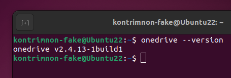
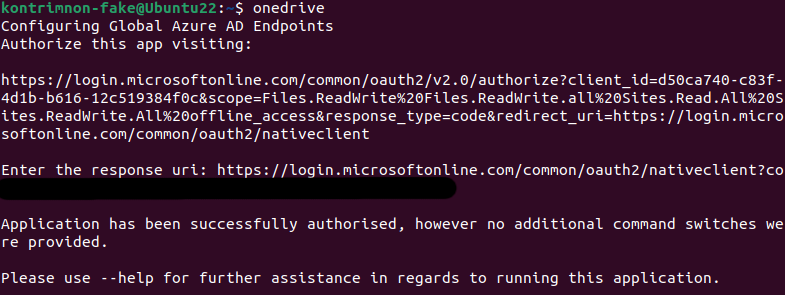
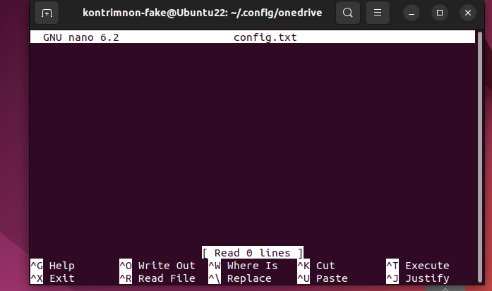

## :memo: Onedrive là gì ? Tìm hiểu chung về công dụng của Onedrive

**OneDrive** là dịch vụ đám mây của Microsoft được sử dụng để lưu trữ dữ liệu của người dùng. Dịch vụ cho phép người dùng kết nối với dữ liệu của họ thông qua việc lưu trữ và bảo vệ dữ liệu. Người dùng có thể chia sẻ dữ liệu với những người khác và truy cập đến chúng từ mọi nơi trên tất cả các thiết bị của họ. Đây được coi là một trong những thế mạnh của dịch vụ lưu trữ đám mây.

:::tip
Khi người dùng sử dụng **OneDrive** bằng tài khoản do công ty hoặc trường học của họ cung cấp, tài khoản đó đôi khi được gọi là "**OneDrive for work or school**." (OneDrive dành cho cơ quan hoặc trường học). Vì từng được gọi là "**OneDrive for Business**" nên đôi khi người dùng vẫn có thể thấy nó được gọi như vậy ở nhiều nơi.
:::


**Tại sao Ubunchuu lại khuyến khích các bạn sử dụng OneDrive ?** Một câu trả lời đơn giản thôi: Chúng ta luôn muốn dữ liệu của bạn thân được lưu trữ, đồng bộ hóa và luôn hiện hữu trên thiết bị mà chúng ta đang làm việc. 

**OneDrive** thể hiện ưu thế qua những công dụng sau: 
- **Lưu trữ tài liệu trực tuyến:** OneDrive luôn sẵn sàng hoạt động và người dùng có thể truy cập nội dung lưu trữ ở mọi lúc mọi nơi với thời gian khả dụng lên đến 99,97% (dựa trên số liệu của Microsoft). 
- **Chỉnh sửa dữ liệu và đồng bộ hóa sự thay đổi trên các thiết bị:** Mỗi khi người dùng có sự thay đổi ở dữ liệu được lưu trữ tren OneDrive, sự thay đổi đó cũng được thể hiện ở các thiết bị có đăng nhập tài khoản OneDrive. Nói một cách dễ hiểu hơn là khi người dùng thêm hoặc xóa dữ liệu trong OneDrive ở một thiết bị nào đó, họ cũng sẽ thấy sự thay đổi đó ở một thiết bị khác có đăng nhập tài khoản OneDrive đó. 
- **Giữ cho các dữ liệu của người dùng được bảo vệ trên điện toán đám mây:** Tính bảo mật chính là một điểm cộng lớn của OneDrive. Việc cung cấp nhiều lựa chọn chia sẻ nội dung sẽ đi kèm với những rủi ro về việc rò rỉ thông tin bảo mật cao của cá nhân hoặc tổ chức. Đây là một lợi thế với các doanh nghiệp vì sẽ có các cấp độ chia sẻ khác nhau với các quyền khác nhau, điều này đảm bảo là dữ liệu sẽ bị giới hạn quyền thao tác khi cần thiết.
- **Khả năng chia sẻ tuyệt vời:** Tính năng chia sẻ mở rộng (Extended Sharing) hỗ trợ trên cả phiên bản online và thư viện tệp tập trung là một trong tính năng vô cùng tiện ích của dịch vụ OneDrive. Điều này cho phép người dùng chia sẻ dữ liệu dưới dạng tệp với mọi người xung quanh hoặc những người cụ thể, và thậm chí những người dùng ẩn danh chỉ bằng những thao tác đơn giản.

Hiện tại OneDrive đang cung cấp 2 loại dịch vụ đám mây với những loại người dùng và nhóm tiện ích khác nhau:
- **Cho gia đình:**
    - **Microsoft 365 Family:** Dành cho một đến sáu người dùng với tối đa năm thiết bị cùng sử dụng một lúc. Dung lượng tối đa 6 TB dung lượng lưu trữ đám mây (1 TB cho mỗi người).
    - **Microsoft 365 Personal:** Dành cho một người với dung lượng lưu trữ đám mây 1 TB.
- **Cho doanh nghiệp:**
    - **Microsoft 365 Business Basic**
    - **Ứng dụng Microsoft 365 dành cho doanh nghiệp**
    - **Microsoft 365 Business Standard:** Mọi tính năng trong Business Basic, cộng thêm nhiều tính năng riêng khác.
    - **Microsoft 365 Business Premium**

Tùy vào từng loại dịch vụ sẽ có mưc giá khác nhau và phương thức thanh toán khác nhau (**Thanh toán hàng năm** / **Thanh toán hàng tháng**)

> Có thể nói từ khi biết đến OneDrive, bản thân mình cảm thấy việc sao lưu, đồng bộ hóa cũng như chỉnh sửa dữ liệu vô cùng dễ dàng, đặc biệt là khi dùng tài khoản do trường hoặc cơ quan cung cấp. 

## Cài đặt và đồng bộ hóa OneDrive trên Ubuntu

Để cài đặt OneDrive, trước tiên, cần cài đặt một số dependency. Các bạn hãy ấn phím tắt `Ctrl + Alt + T` hoặc mở Terminal một cách thủ công và thực hiện các bước sau:

Nếu thiết bị của bạn đã cài đặt trước OneDrive với bất kỳ PPA repository, Ubunchuu khuyến khích các bạn nên xóa hết và cài đặt mới lại từ đầu để đảm bảo các bạn được trải nghiệm phiên bản mới nhất của OneDrive

> Debian repository là một tập hợp các gói Debian được tổ chức trong một cây thư mục đặc biệt, được sử dụng để lưu trữ các chương trình cài đặt. Các thiết bị có thể kết nối đến repository để tải xuống và cài đặt các gói bằng công cụ Quản lý gói ([PackageManagement](https://wiki.debian.org/PackageManagement)) dựa trên [Apt](https://wiki.debian.org/Apt).

### Xóa OneDrive đã có sẵn trên thiết bị

Nếu thiết bị của bạn chưa cài đặt OneDrive, bạn có thể bỏ qua bước này và tiếp tục ở bước **Cài đặt OneDrive**

Đầu tiên, hãy thực hiện việc xóa OneDrive (nếu đã có sẵn trong OS).

```bash
sudo apt remove onedrive
sudo apt autoremove
```

Hãy chạy lệnh `apt update` để thực hiện việc cập nhật danh sách các packages của hệ thống và lệnh này sẽ không thực hiện nâng cấp bất kỳ package nào của hệ thống cả.

```bash
sudo apt update
```

### Cài đặt OneDrive

Thao tác cài đặt OneDrive sẽ được thực hiện qua câu lệnh sau:

```bash
sudo apt-get install onedrive
```

Quá trình cài đặt sẽ không tốn nhiều thời gian, để kiểm tra xem OneDrive đã cài đặt thành công hay chưa, các bạn có thể nhập lệnh sau:

```bash
onedrive --version
```



> Terminal sẽ hiển thị kết quả là phiên bản mới nhất của OneDrive được cài đặt trong máy.

Để bắt đầu sử dụng OneDrive, hãy nhập `onedrive` vào Terminal và ấn Enter.

```bash
onedrive
```

Kết quả trả về là một đường link đăng nhập của OneDrive. Các bạn hãy copy đường link đó vào trình duyệt và tiến hành đăng nhập như thông thường. Sau khi đăng nhập, các bạn sẽ được trình duyệt chuyển đến một trang trống, hãy copy đường link của trang đó và paste vào Terminal nhé.

> Lưu ý: Để paste vào Terminal, các bạn có thể chuột phải chọn **Paste** hoặc ấn tổ hợp phím tắt **`Ctrl + Shift + V`** (thêm phím tắt **Shift** so với thông thường).


Sau khi thao tác, các bạn sẽ thầy dòng thông báo biểu thị việc đăng nhập thành công.

> Application has been successfully authorised, however no additional command switches were provided



Lúc này, các bạn có thể sử dụng lệnh sau đề đồng bộ hóa tất cả dữ liệu trên OneDrive xuống máy của các bạn:

```bash
onedrive --synchronize
```

Để biết thêm nhiều tùy chọn khác của OneDrive như `loggout`, ..., vui lòng nhập lệnh sau:

```bash
onedrive --help
```


## Cách config OneDrive

Khi thực hiện việc đồng bộ hóa dữ liệu theo mặc định, OneDrive sẽ tự tạo một folder có tên **"OneDrive"** ở đường dẫn ```/home/user_name/```. Tuy nhiên, nếu không muốn lúc nào cũng phải truy cập ở đường dẫn này, các bạn có thể thay đổi đường dẫn cho OneDrive để nó đồng bộ hóa vô một thư mục với đường dẫn nhất định.

Ở đây, tụi mình muốn OneDrive sẽ đồng bộ hóa dữ liệu vào thư mục ```Documents``` trong hệ thống. Cách cài đặt sẽ được thực hiện như sau: 

Đầu tiên hãy tạo file config của OneDrive trong hệ thống.

```bash
mkdir -p ~/.config/onedrive
cd ~/.config/onedrive
sudo touch config.txt
```

Tiếp theo, chúng ta sẽ mở file ```config.txt``` lên và tiến hành cấu hình. Có hai tùy chọn cấu hình là: **“sync_dir”** và **“skip_files”**.
- **sync_dir:** Vị trí lưu trữ các file OneDrive. Tất cả các file trên đám mây sẽ được đồng bộ vào trong thưc mục này. Mọi thao tác với dữ liệu trong thư mục này cũng sẽ được đồng bộ ngược lại lên OneDrive.
- **skip_files:** Loại file (hoặc mẫu file) không được đồng bộ. Tuy nhiên, nếu bạn muốn đồng bộ hóa hết tất cả dữ liệu thì bạn không cần quan tâm tới cấu hình này.

Để mở file ```config.txt```, các bạn thực hiện câu lệnh sau:

```bash
sudo nano config.txt
```



Các bạn hãy thêm vào file dòng sau:

```text
sync_dir = "~/Documents"
```


Đây là thao tác đồng bộ hóa dữ liệu trên OneDrive vào thư mục **Documents** với cấu hình là tất cả các định dạng của dữ liệu. Chẳng hạn, nếu các bạn không muốn đồng bộ hóa các file có đuôi `.bat`, hãy thêm vào bước trên dòng lệnh sau nhé: 

```text
skip_file = ".bat"
```

Sau đó hãy ấn **Ctrl + X** và chọn **Y** để lưu lại file cấu hình này. Cuối cùng, hãy nhập lệnh để OneDrive tiến hành đồng bộ hóa dữ liệu nha.

```bash
onedrive --synchronize
```

Kết quả cuối cùng là thư mục chúng ta mong muốn đã được đồng bộ hóa dữ liệu.

## Khởi động OneDrive khi đăng nhập

Thông thường, OneDrive không tự khởi động khi đăng nhập. Tuy nhiên, Ubunchuu có cách để giúp các bạn khắc phục việc này.

Hãy nhập dòng lệnh sau để OneDrive luôn khởi động cùng thiết bị nha.

```bash
systemctl --user enable onedrive
systemctl --user start onedrive
```

## Lời kết

Như vậy, Ubunchuu đã dành ra một bài viết nhỏ để giúp các bạn có thể làm việc với OneDrive trên Linux. Điều này giúp cho học tập, công việc của chúng ta trở nên thuận tiện hơn bao giờ hết vì dữ liệu luôn sẵn sàng mọi lúc, mọi nơi. 

Nếu các bạn gặp lỗi trong quá trình cài đặt, các bạn vui lòng liên hệ với tụi mình để tụi mình có thể giúp các bạn khắc phục lỗi giúp các bạn sớm nhất có thể nha. Chúc các bạn thành công :3