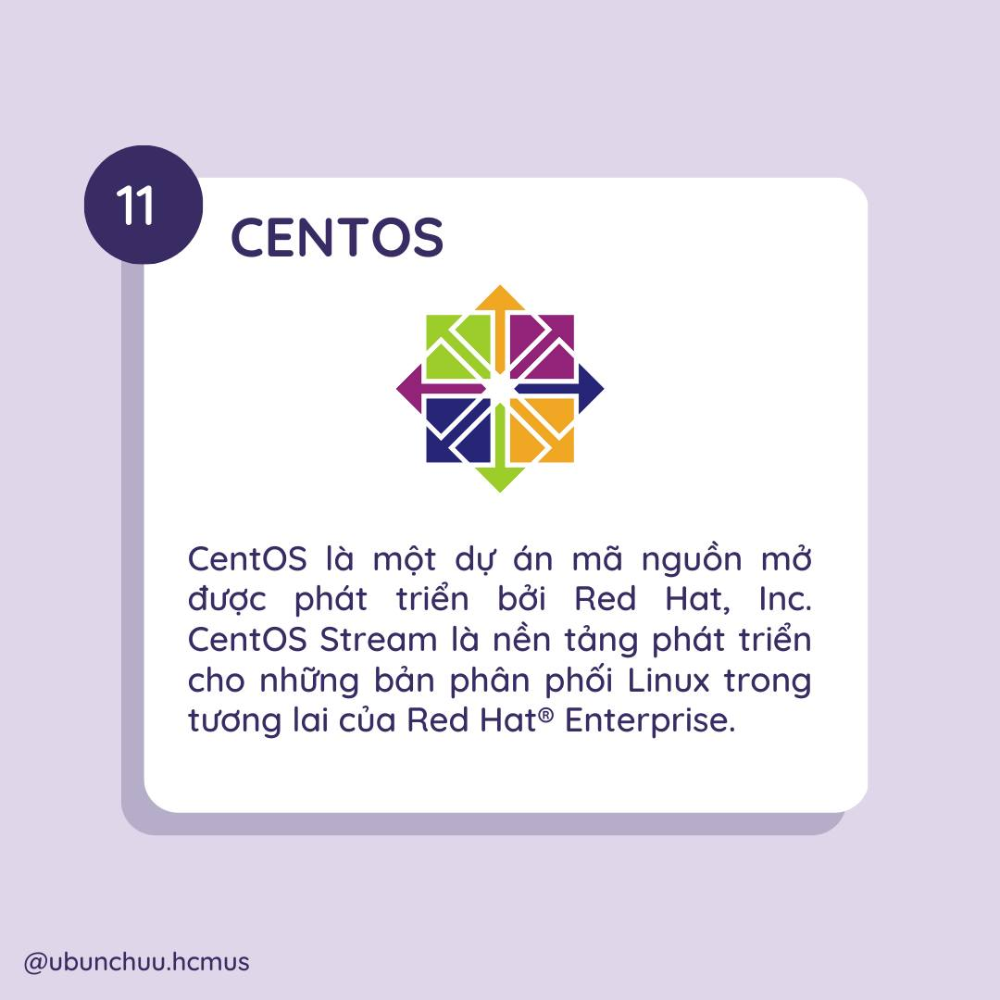
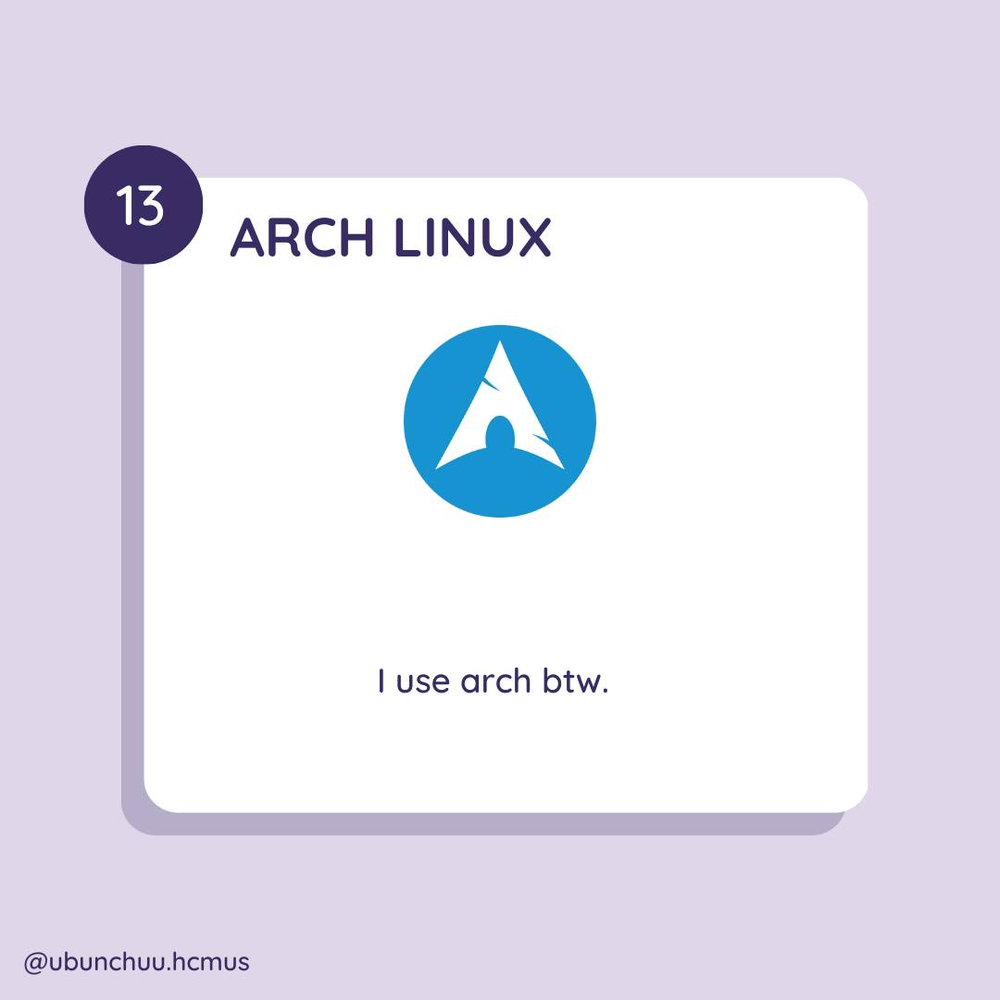

:::info
Distro? Nghe quen nhỉ, chắc hẳn các bạn cũng đã từng nghe cụm từ này ở đâu đó hoặc hiểu rất rõ về nó nếu như bạn là người có đam mê công nghệ, và niềm đam mê với Linux.
:::

## Bạn có biết?

Distro là từ viết tắt của "linux distribution", có tên tiếng việt là phân phối của Linux.

## Distro là gì?

- Một bản phân phối của linux (hay distro) là một hệ điều hành được lập trình từ những tùy biến dựa trên nhân Linux. Những tùy biến này có thể giải thích đơn giản là sự thay đổi trong cách đóng gói packages bên trong hệ điều hành cùng với nhân Linux, cùng các công cụ GNU, thư viện cũng như tiện ích, ứng dụng khác nhau cho phù hợp với nhu cầu người sử dụng.

- Bên trong một distro bao gồm:
  - Nhân Linux (kernel)
  - Tổng hợp các ứng dụng và tiện ích đã tùy biến
  - Trình cài đặt và quản lý packages

:::warning :shamrock: **Ghi nhớ**
Distro đơn giản là một phiên bản "biến hóa" của hệ điều hành dựa trên nhân linux, được tùy biến tùy theo nhu cầu của người sử dụng.
:::

## Các nhánh distro

Linux được chia làm nhiều nhánh và các distro của nó được phát triển dựa trên từng nhánh riêng biệt này. Trong đó, Ubuntu là một Distro thuộc nhánh Debian, rất phù hợp nếu bạn là người mới.

Linux hiện đang được chia làm các nhánh chính như sau:
- Debian Based Linux Distributions
- RPM Based Linux Distributions
- Một số bản phân phối khác: Slackware, Arch

### Debian

Là nhánh mang hướng phi thương mại và là một trong những nhánh ra đời sớm nhất, được duy trì bởi cộng đồng phát triển mạnh mẽ.

Có 3 nhánh chính của Debian được hỗ trợ dài hạn:
- Nhánh ổn định: Đây là bản phát hành hiện tại, hướng tới độ tối ưu và ổn định một cách tối đa. Các phiên bản ổn định của Debian thường sẽ được phát hành sau một khoảng thời gian phiên bản thử nghiệm đã được nhà phát hành khắc phục gần hết lỗi lớn nhỏ (thường có chữ LTS).
- Nhánh thử nghiệm: Đây là phiên bản tiếp theo của phiên bản ổn định ở hiện tại. Phiên bản thử nghiệm thường ẩn chứa nhiều lỗi trong hệ thống cùng packages không ổn định. Việc cập nhật lên phiên bản thử nghiệm quá sớm có thể khiến hệ thống của bạn không ổn định. Tuy nhiên đây cũng là lúc mà cộng đồng người dùng có thể đóng góp để giúp nhà phát hành khắc phục lỗi và cho ra thêm nhiều tính năng mới phù hợp với nhu cầu người dùng.
- Nhánh không ổn định: Đây là nhánh được phát hành mà trong đó những packages chưa được thông qua kiểm tra nên sẽ tiêm ẩn nhiều nguy cơ xảy ra lỗi trong quá trình sử dụng.

### Ubuntu

Được phát hành vào năm 2004, Ubuntu được dựa trên phiên bản không ổn định của Debian. Với sự phát triển, đóng góp của cộng đồng, Ubuntu đã và đang trở thành một trong những distro được sử dụng nhiều nhất. 

Ubuntu sử dụng giao diện đồ họa người dùng (GUI) GNOME (GNU Network Object Model Environment) mang đến một giao diện thân thiện với người dùng và chính nhờ vậy, đây là một distro phù hợp cho những người mới tiếp cận đến “Linux”.

### Linux Mint

Đây là một bản phân phối dựa trên Ubuntu. Linux Mint được đánh giá là có giao diện thân thiện nhất với người dùng Windows. Tương tự như các distro khác, Linux Mint có cộng đồng người dùng lớn, giúp cho distro này ngày càng phát triển mạnh và trở thành lựa chọn thay thế tốt cho Ubuntu.

### Kali Linux

Là một bản phân phối dựa trên Debian, mục tiêu của nó là: tập hợp nhiều công cụ kiểm tra bảo mật và thâm nhập tốt nhất có thể trong một môi trường hệ điều hành. Bạn có thể tìm thấy nhanh gọn nhiều công cụ mã nguồn mở để thực hiện các quy trình kiểm thử (pentest), tấn công, điều tra số, dịch ngược, … Kali Linux là hệ điều hành ưa thích của nhiều hacker trên thế giới.

### Fedora

Là nhánh được phân phối phi thương mại được phát hành bởi Red Hat, được tạo ra nhằm kiểm thử các công nghệ cho một bản phân phối thương mại khác của Red Hat, nơi mà các phần mềm nguồn mở mới được tạo lập, phát triển và kiểm thử trong phiên bản miễn phí trước khi đưa tính năng ấy chính thức vào Red Hat Enterprise.

### OpenSUSE

Đây là một dự án mã nguồn mở với các bản phân phối dựa trên Linux do SUSE - một công ty phần mềm mã nguồn mở, đa quốc gia, có trụ sở tại Đức phát triển và kinh doanh Linux cho các khách hàng doanh nghiệp. OpenSuse được biết đến với cả KDE Desktop và Gnome Desktop mang đến sự đa dạng cho người dùng.

### CentOS

CentOS là một dự án mã nguồn mở được phát triển bởi Red Hat, Inc. là một công ty phần mềm Mỹ cung cấp sản phẩm phần mềm mã nguồn mở cho cộng đồng doanh nghiệp. CentOS sở hữu hai bản phân phối riêng biệt: CentOS Stream và CentOS Linux. CentOS Stream là nền tảng phát triển cho những bản phân phối Linux trong tương lai của Red Hat® Enterprise.

### Slackware

Là nhánh đầu tiên được phân phối trên nhân linux. Slackware không có trình quản lý packages và tất cả phần mềm được biên dịch bởi quản trị viên hệ thống hoặc người dùng bình thường của hệ thống.

### Arch

Một bản phân phối nhắm vào những người dùng Linux có kinh nghiệm và được duy trì bởi một cộng đồng mạnh mẽ trên tinh thần tình nguyện, cung cấp các packages chính thức và một loạt các packages không chính thức do người dùng gửi. Các packages thường được định hình để cài đặt bởi một tệp văn bản gọi là PKGBUILD (Ubunchuu sẽ có một chủ đề riêng tất tần tật về Arch Linux).

:::warning tips
Hãy cân nhắc chọn một Distro phù hợp với mình và có mục đích sử dụng phù hợp với nhu cầu của mình.
:::